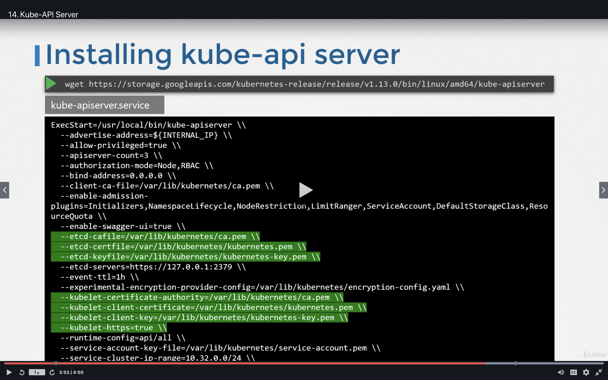
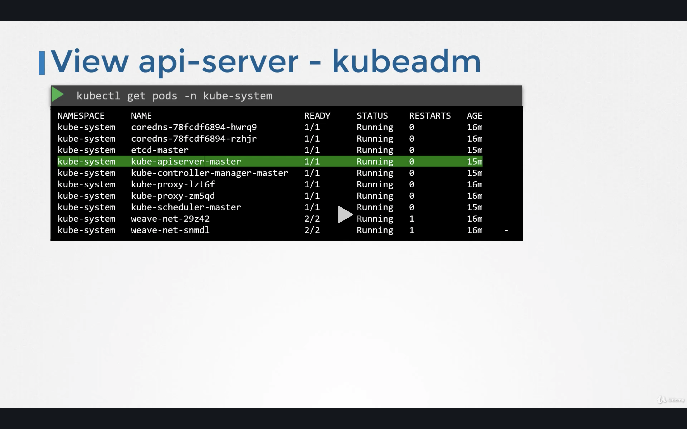
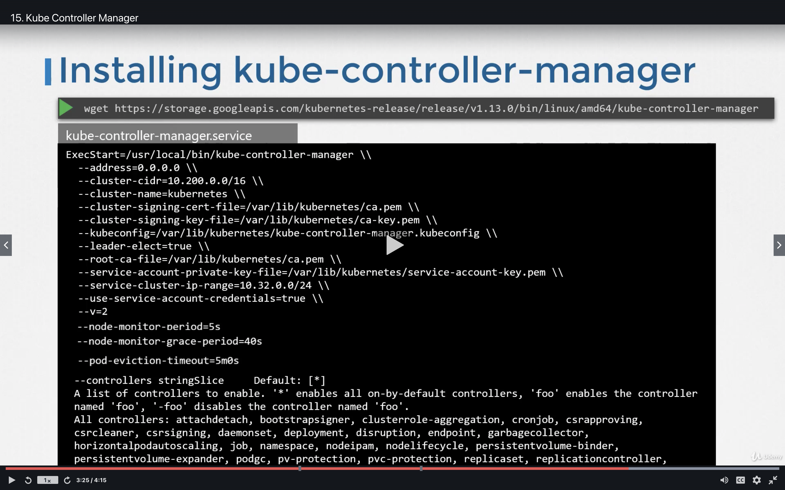

# Core Concepts

## A) Cluster | High-Level Components

1) Master Node - Manages, Plans, Schedules, & Monitors Nodes

2) Worker Nodes - Host Applications as Containers

### Master Node | High-Level Components

1) API Server (kube-apiserver) -  

2) Cluster Store (etcd) - DB that stores info/configuration in Key-Value Store

3) Kube-Scheduler - 

4) Controller-Manager
    - Node-Controller
    - Replication-Controller

3) Kube-Proxy 

### Worker Node | High-Level Components

1) Kubelet - Communicates w/ API Server
    - Registers Worker Node w/ API Server
    - Listens for Instructions - From Kube-API Server 
        - Deploys/Destroys containers as per API Server's instructions
        - API-Server will periodically fetch status reports from Kubelet 
          for node status's

2) Kube-Proxy - Allows communication between worker nodes
    - Has rules that ensure worker nodes' containers can communicate with each other
    
3) Container Runtime - Allows for contain**er-related tasks (pulling/pushing images, etc.)
    

## B) Etcd | In-Depth

### Definitions

Etcd - Distributed reliable key-value store that is simple, fast, & secure. 

K-V Store - As opposed to Tabular/Relational Databases,
- No Duplicates
- Only 2 Columns (K/V)

### Getting Started
- Runs on - Port 2379 (By default)
- You can then attach any clients to etcd service to store/retrieve info
- Default Client - "etcdctl" (Etcd Control Client)
    - Can use it - to store/retrieve k/v pairs
    
### 2 Ways to Deploy etcd

#### 1) From Scratch | In "etcd.service" \

    ExecStart=/usr/local/bin/etcd \\ \
    ... \
    --advertise-client-urls https://${INTERNAL_IP}:2379 \\
    ... \

#### 2) From kubeadm

Kubeadm - Will deploy etcd as a ***pod*** in *kube-system* namespace (called "etcd-master")
- To List all keys stored by K8s, run the following:
  
        kubectl exec etcd-master -n kube-system etcdctl get --prefix -keys-only

### How K8s stores KV data in etcd

- Root Directory - Is a ***Registry***
- Subdirectories - Various k8s Constructs (Minions, Nodes, Pods, Replicasets, Deployments, etc.)
- High Availability Environment - Will have multiple Master Nodes in the Cluster 
    - Will then have multiple etcd instances spread across Master Nodes 
      
Ensuring multiple etcd instances are aware of each other: 

    ExecStart=/usr/local/bin/etcd \\ \
    ... \
    --initial-cluster controller-0=https://${CONTROLLER0_IP}:2379,controller-1=https://${CONTROLLER1_IP}:2380 \\
    ... \

---
### Etcd Commands
ETCDCTL - CLI Tool used to interact w/ ETCD 

## C) Kube-API Server | In-Depth

### Background

Kubectl - Actually reaches kube-apiserver. API Server then authenticates, gets data from *etcd* & responds back.

#### API Server | Main Steps
1) Authenticate User
2) Validate Request
3) Retrieve data
4) Update ETCD
5) Kube-Scheduler
6) Kubelet (In a worker Node)

#### 2 Ways to Setup

1) Use KubeAdm

2) "wget https://storage.googleapis.com/kubernetes-release/release/v1.13.0/bin/linux/amd64/kube-apiserver"

#### Where is api-server deployed (via kube-adm)?

#### Viewing API-Server Options:

1) kubeAdm - *cat /etc/kubernetes/manifests/kube-apiserver.yaml*

2) Non-kubeadm - *cat /etc/systemd/system/kube-apiserver.service*

3) Running process - *ps -aux | grep kube-apiserver*

## D) Kube-Controller Manager | In-Depth

### Node Controller 

- Checks Nodes via - API Server
    - **Node Monitor Period** - 5 Seconds
- Unreachable Nodes - Nodes that don't respond w/ a heartbeat. \
  - Marked unreachable after Node Monitor Grace Period (below).
  - **Node Monitor Grace Period** - 40 Seconds
- **POD Eviction Timeout** - 5min
    - If Node doesn't come back, the pods will be...
        1) Evicted from that Node
        2) Provisioned on a different, healthy Node
    

### Installing Kube_controller_manager

Note - The Node-Controller manager options mentioned above are shown below:
    - node-monitor-period
    - node-monitor-grace-period
    - pod-eviction-timeout

Also - ***--controllers*** holds the list of controllers available for you to use (you can add/remove as desired).

#### Viewing kube-controller-manager Options:

1) kubeAdm - *cat /etc/kubernetes/manifests/kube-controller-manager.yaml*

2) Non-kubeadm - *cat /etc/systemd/system/kube-controller-manager.service*

3) Running process - *ps -aux | grep kube-controller-manager*

## E) Kube-Scheduler | In-Depth

**kube-scheduler** - Decides which pod goes on which Node \
    - ***kubelet*** actually places the pod on a particular node

### 2 Phases

#### E1) Filter Nodes
Filters Nodes that don't fit resource requirements (CPU, Memory, etc.)

#### E2) Rank Nodes
Ranks Nodes - From 1-10
- For example, calculates how many resources would be remaining on a node after scheduling the pod on it

### View kube-scheduler options | kubeadm

    - cat /etc/kubernetes/manifests/kube-scheduler.yaml

## E) Kubelet | In-Depth

### Kubelet | On Master Node

1) Sole point of contact on Master Node

2) Schedules Pods on a Node as requested by Kube-Scheduler

3) Send regular status updates back to API Server

### Kubelet | On Worker Node

1) Registers Node w/ the Cluster

2) When Kubelet receives instructions to schedule a Pod on the Node
    - Requests Container Runtime (ie. Docker, containerd) to pull down image

## F) Kube-Proxy | In-Depth

0) ***Recall*** - Within a K8s cluster, every pod can reach every other pod
    - Accommplished by using a POD networking solution

####Services - Used for sending data to Pods (since Pod IP's change too much due to IP Churn)

0) ***Does Not*** - Join a Pod Network
    - Is a virtual K8s Construct that only lives in K8s memory
    - But how is it accessible from any node across the cluster
   
 
1) ***Kube-Proxy*** - Everytime a New service is created
    - Creates rules on each node to forward traffic from services to Backend Pods

    

