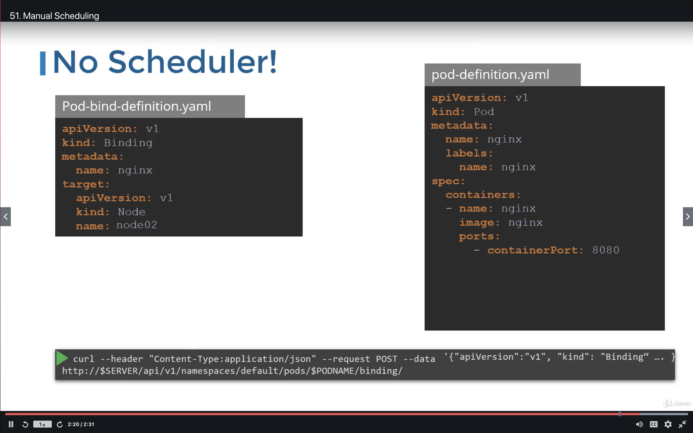
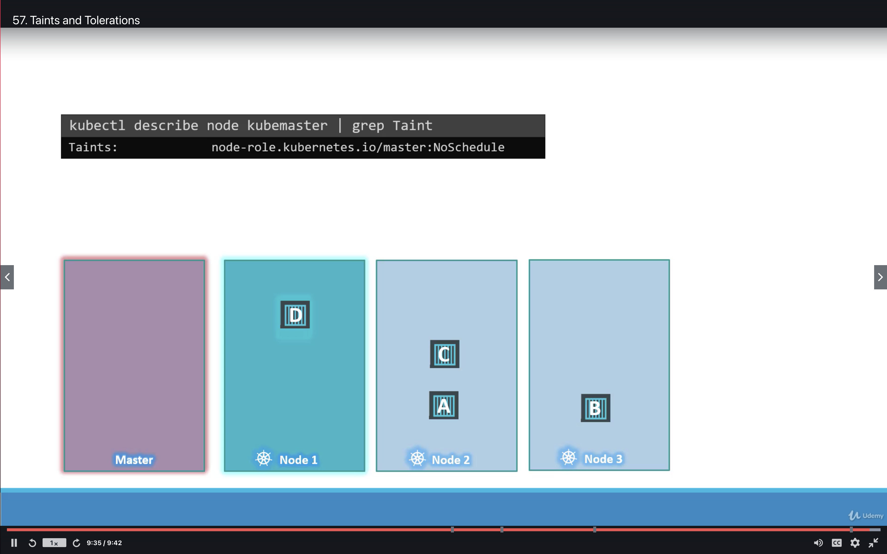
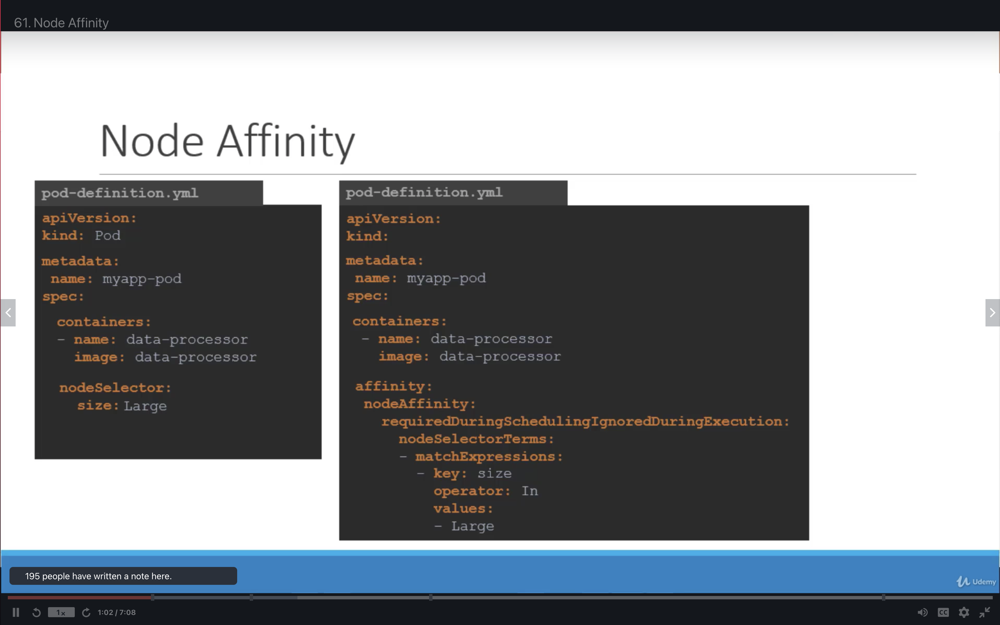
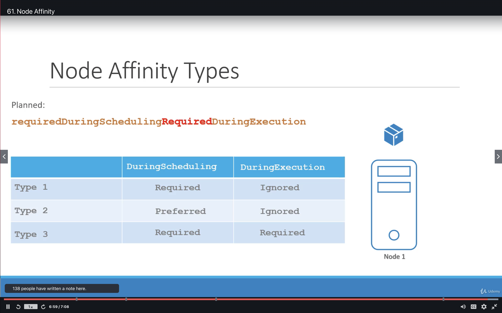
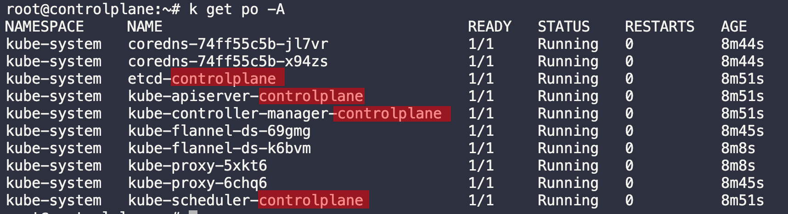
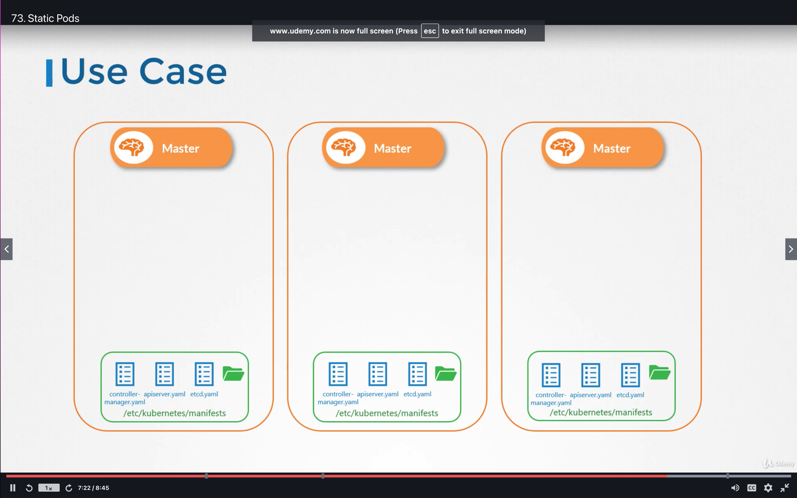
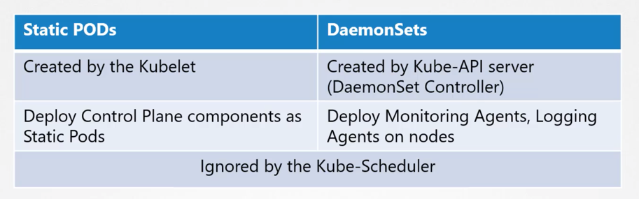
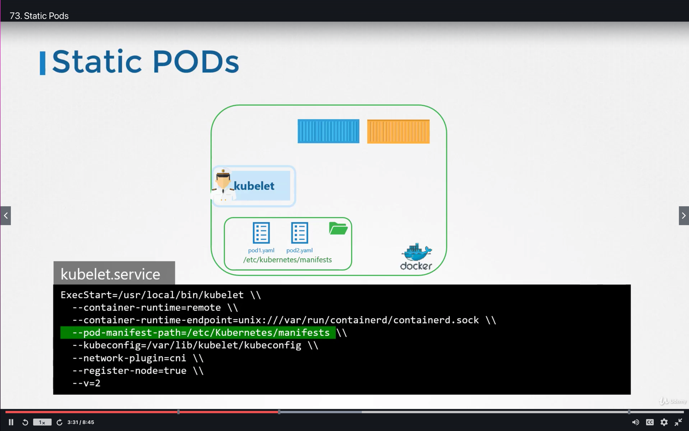
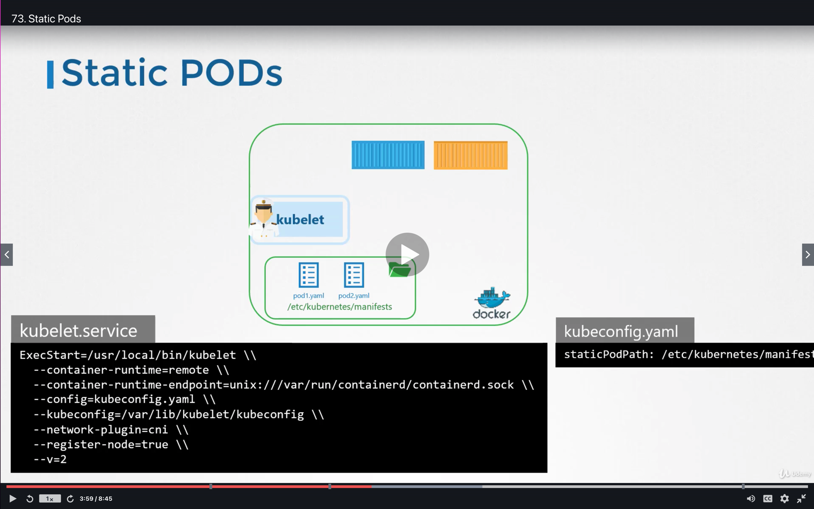

# Introduction

There are 4 primary ways you can schedule a Pod on a Node. They are the following
1) Manual/Static Scheduling
    - Name
    - Labels
2) Taints & Tolerations
3) NodeSelectors
4) Node Affinity

---
## Manual Scheduling 

There are two primary ways to manually schedule a Pod on a Node. They are by specifying
1) NodeName - *pod.spec*.***nodeName***
   - ***Can only specify at Pod's  creation time*** (cannot be modified)
2) NodeSelectors - *pod.spec*.***nodeSelector***
   - Can't select exclusions (ie. don't place on Node with Label "Size: Large", etc.)

#### Binding | For modifying NodeName after Pod Creation

-----
## Taints & Tolerations

#### Main Takeaway - Only tells pods which nodes to Avoid (Not which ones to schedule on)

- Taints - Applied to ***Nodes***
- Tolerations - Applied to ***Pods***

#### Tainting Nodes

      k taint nodes NODE-NAME KEY=VALUE:TAINT-EFFECT

Taint-Effects
   1) ***NoSchedule*** - Don't schedule non-tolerating Pod on this Node
   2) ***PreferNoSchedule*** - Try not to schedule non-tolerating Pod on this Node
   3) ***NoExecute*** - Evict all non-tolerating pods from this Node, + NoSchedule

Master-Taint - Note that the Master Node has a *NoSchedule* Taint to prevent Pods from being scheduled on it

## NodeSelectors

## Node Affinity

### Node Affinity Types
1) requiredDuringSchedulingIgnoredDuringExecution
2) preferredDuringSchedulingIgnoredDuringExecution

### Operators
1) ***In*** - Select a Node where its value is one of the following in 
   "pod.spec.affinity.nodeAffinity.rDSIDE.nodeSelectorTerms.matchExpressions.values"
2) ***Exists*** - Selects a Node 

## DaemonSets

### Overview 
***DaemonSets***: Ensures 1 Copy of the Pod is always present on every Node in a Cluster
- Like Deployments - Helps deploy multiple Pod instances 
- Unlike Deployments - Deploys ONE Copy of a Pod to EACH NODE in your Cluster

When a Node:
   - Is Added - New Pod Instance is Added
   - Is Removed - Pod Instance is Removed

### Use-Cases

1) Monitoring/Logging - Deploy a Pod for Visibility to all Nodes
2) Kube-Proxy - Can Implement Kube-Proxy as a DaemonSet
3) Networking - Networking sol'ns like *weavenet* require an agent to deployed to every node in the cluster

### Under the Hood
Uses NodeAffinity + Default Scheduler (from v.1.12 onwards)

## Static Pods

**Recall** - Kubelet relies on kube-apiserver for details on which pod to run. 

Kubelet - Will periodically check ***"/etc/kubernetes/manifests"*** for pod yamls

These Pods Will be Restarted ***When...***
- Application Crashes
- User modifies the Pod YAMLS

***NOTE*** - Only Pod manifests can be placed here (Not Deployments, RS's, etc.)

***NOTE*** - The API Server is aware of static Pods \
- If the Kubelet is part of the  cluster
  - A Read-Only copy of the static Pod will be created on the Control Plane \
      - This Read-Only copy will have the node-name appended to it (ie. "static-web-node01")

        
***Why Static Pods?*** - *To Deploy **Control Plane** components onto Worker Nodes themselves*

###Static Pods Vs. DaemonSets

### KubeAdm Approach

