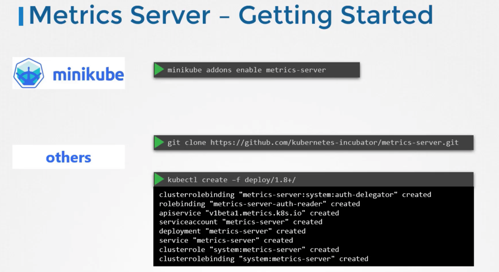

## Overview
Mainly, we want to monitor the following in K8s: 
1) Cluster Components
2) Cluster Component Logs
3) Applications
4) Application Logs

Currently, there is no all-in-1 sol'n available. But common 3rd party tools include: 
1) Metrics Server - Slimmed down version of "Heapster", which was an older, popular tool (now deprecated)
   - In-Memory Monitoring Solution
   - Disadvantage - Can't see historical data (since it's in-memory)
2) Prometheus
3) Elastic Stack
4) DataDog
5) Dynatrace

KUBELET NOTE:
- Contains a subcomponent called *cAdvisor* (containerAdvisor) that is responsible 
  for retrieving performance metrics from pods & exposing them through kubelet's API to make them available
  to metrics server

---
## K8s Pod Logging | Simple

kubectl logs -f POD -c CONTAINER 
1) ***-f*** - For streaming directly to stdout
2) ***-c*** - For MC Pods
   
Suppose - We run the image in detached mode --> ***docker run -d kodekloud/event-simulator***

