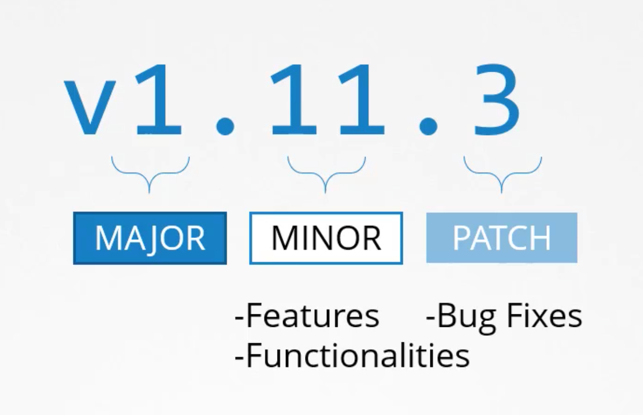
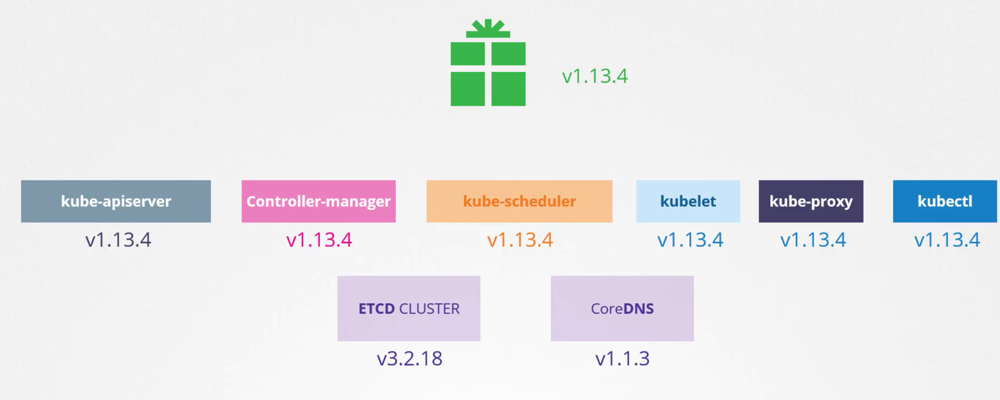
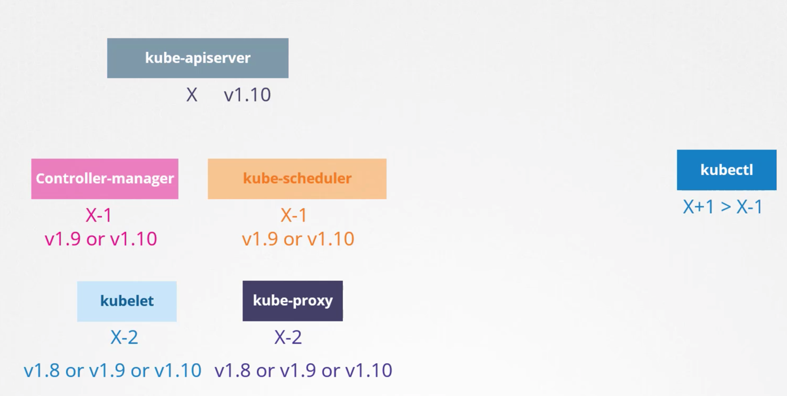
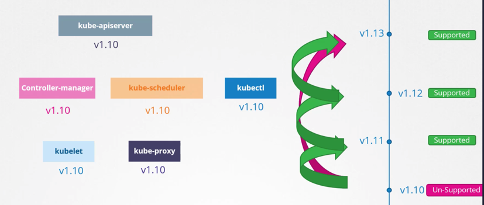
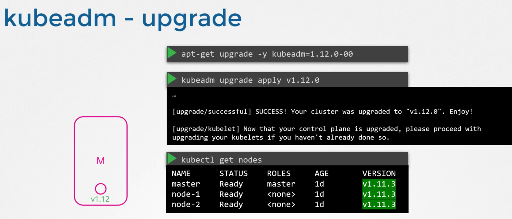
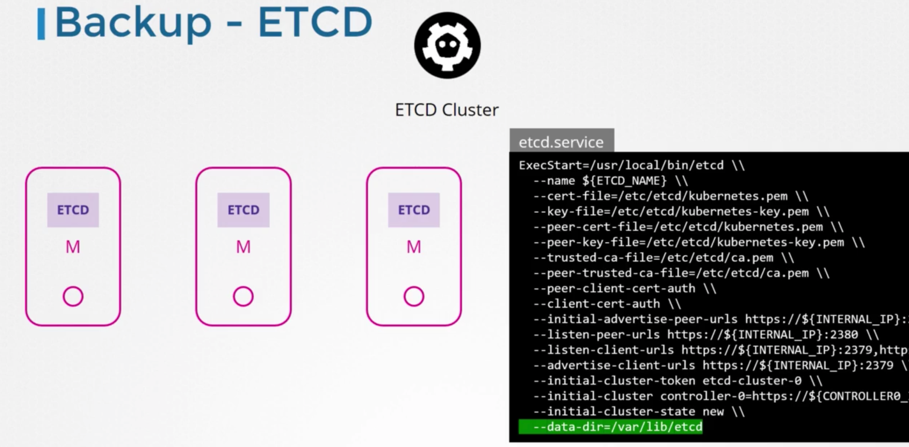
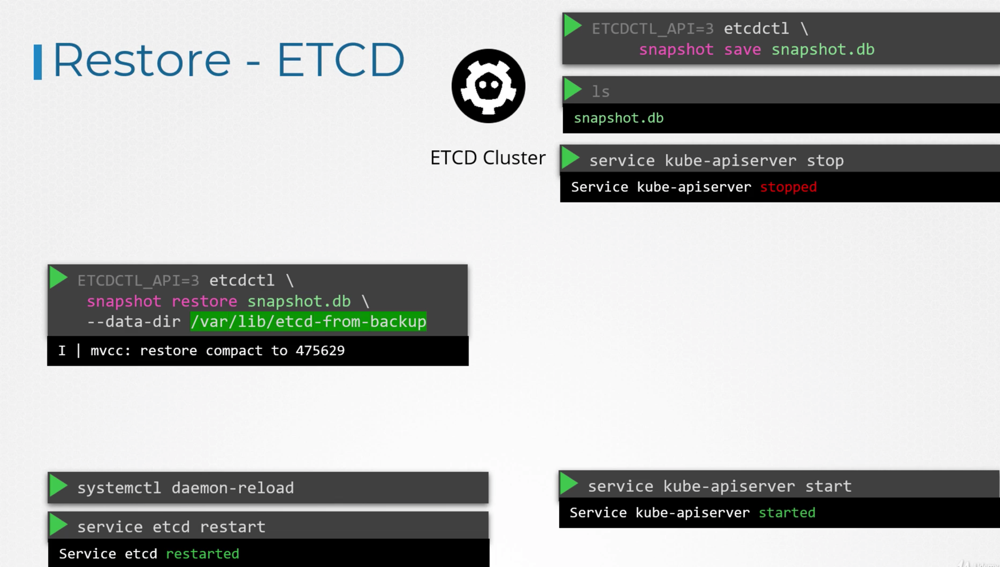
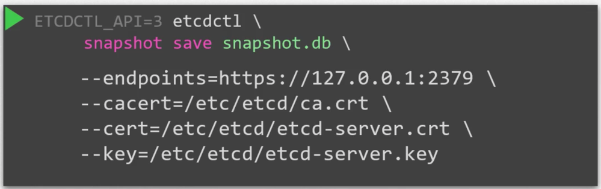

# Cluster Maintenance
##Overview | Sections

### A) Operating System Upgrades 
### B) Cluster Upgrade Process
### C) Backup & Restore Methodologies

## A) Operating System Upgrades

***Setup*** - Imagine you have a cluster with 1 Master Node, 3 Worker Nodes.
1) Worker Node A - Blue/Green Pods
2) Worker Node B - Blue/Purple Pods
3) Worker Node C - Red/Grey Pods

***Scenario*** - Worker Node A is taken down for maintenance. Blue Pod was part of a RS, so it will get rescheduled \
    - **But Green Pod was not part of a ReplicaSet, so it's just gone** \
    - Recall - Default Pod_Eviction_Timeout === 5 min

We want to be able to reschedule the Pods onto other nodes prior to taking down the Node for maintenance.

### kubectl drain [NODE]
1) Removes all Pods from a Node && Marks Node as "Unschedulable"
    - If API-Server supported - Evicts the Pods
    - If no API-Server support - Normal DELETE
    - Pods should be managed by "ReplicationController, ReplicaSet, Job, DaemonSet, or StatefulSet"
    - If trying to delete unmanaged Pods, use ***--force*** flag
2) **Will not delete**
    - ***Mirror Pods*** (Static Pod copies that live on API Server)
    - ***DaemonSet Pods***
        - Daemonset controller ignores "Unschedulable" Node markings, so it would reschedule immediately regardless
3) **DaemonSet NOTE** - If you have DS-managed pods on a node, use ***kubectl drain NODE --ignore-daemonsets***
    - Else ***kubectl drain*** will fail.

### kubectl cordon [NODE] // Marks a Node as "Unschedulable"
### kubectl uncordon [NODE] // Marks a Node as "Schedulable"

## Kubectl Versions

### NOTE - ETCD/CoreDNS have different versions than the other k8s (since they are technically independent)

## B) Cluster Upgrade Process

***API-SERVER NOTE*** - Since *kube-apiserver* is the primary component of the control plane, 
all other components should have versions lower than API Server. 

### kubeadm | Cluster Upgrading | 2 Major Steps
 
1) Upgrade Master Nodes
- While Master Node is down - Worker Nodes will continue to run
- But can't access cluster via kubectl, cannot deploy new apps, delete/modify existing ones, 
  automatically spin up new pods to replace dead ones, etc.

2) Upgrade Worker Nodes | 2 Ways
- Upgrade all Nodes at once - (Terrible Idea)
- Upgrade single Node at a time - Via "kubectl drain". Will evict Pods to other Worker Nodes (so almost 0 downtime)
- OR - If using cloud provider, just reprovision a new node w/ new version, & remove an old Node.

**NOTE** - kubeadm does NOT upgrade ***kubelet***. Only upgrades the following:
1) API Server
2) Controller Manager
3) Scheduler
4) Kube Proxy
 
### *kubeadm upgrade plan* | Running preflight checks. Checks the following:
- Cluster Version
- kubeadm Version
- Latest k8s Version

### kubeadm | Upgrading Master Node
1) ***apt-get upgrade -y kubeadm-1.13.0-00*** - Upgrade ***kubeadm***
2) ***kubeadm upgrade apply v1.12.0*** - Upgrade Master Node
3) ***kubectl get nodes*** - Actually shows the ***kubelet*** versions (actually won't show updated version)

### Does the Master Node have a Kubelet?
1) YES - If you deployed via kubeadm
2) NO - If you deployed the "Hard Way"

### Upgrading the Kubelet
1) ***apt-get upgrade -y kubelet=1.12.0-00*** - Upgrade ***kubelet***
2) ***systemctl restart kubelet*** - Restart kubelet
3) ***kubectl get nodes*** - 

## Backup & Restore Methodologies

### Imperative vs Declarative 

Declarative - Is better, because if they're stored in source code repositories, they can easily be "reapplied", 
even if the entire cluster is down. 

But what if a team member happened to create objects imperatively?

### Backup Resource Configs

Can use
1) Command like - ***kubectl get all -A -oyaml > all-deploy-services.yaml***
2) Services like Velero (formerly ARK by Heptio) - That do it for you

### Backup Etcd | 2 Ways

1) Etcd Directory, belongs to ***data-dir*** key in "ExecStart" // Default is ***/var/lib/etcd***

   
2) Use etcdtl's builtin snapshot tool - ***ETCDCTL_API=3 etcdtl snapshot save snapshot.db***
- NOTE - Will need to stop ***kube-apiserver***, and then restore the snapshot from the file.
- NOTE - When restoring up from a snapshot, etcd will initialize a new cluster-configuration & configures
etcd members as new members of the cluster. This is to prevent new members from joining an existing cluster
=

ALL STEPS:
1) ***ETCDCTL_API=3 etcdtl snapshot save snapshot.db***
2) ***service kube-apiserver stop*** - Stop the API Server
3) ***ETCDCTL_API=3 etcdtl snapshot restore snapshot.db --data-dir /var/lib/etcd-from-backup***
4) ***systemctl daemon-reload*** - Reload Service Daemon
5) ***service etcd restart*** - Restart Etcd Service
6) ***service kube-apiserver start*** - Start Kube-API Server

### NOTE - Also save the following certificates

