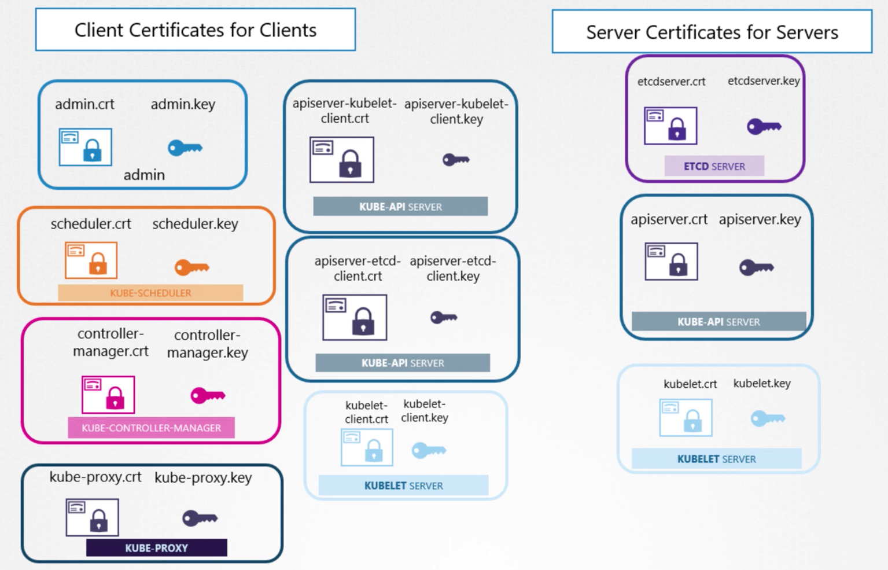
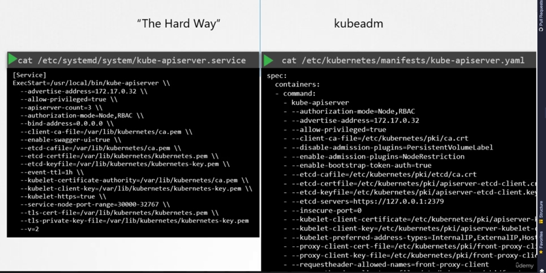

# Security

## Overview
1) Kubernetes Security Primitives
2) Secure Persistent Key Value Store
3) Authentication
4) Authorization
5) Security Contexts
6) TLS Certificates for Cluster Components
7) Images Securely
8) Network Policies

## 1) Security Primitives

### Secure Hosts | Please Secure Your Hosts!!
1) Root Access - Disabled
2) Password-based AuthN - Disabled
3) ONLY SSH Key AuthN - Enabled

### Recall | kube-apiserver
- Center of all Cluster-related Operations
- ***Must control access to API-Server!!***

### A) Authentication
1) Files - Username & Passwords
2) Files - Username & Tokens
3) Certificates
4) External Authentication Providers - LDAP

### B) Authorization
1) RBAC Mode
2) ABAC Mode
3) Node Mode 
4) Webhook Mode

### C) TLS Certificates

### D) Pod2Pod Communication
- Restrict Access between Pods - ***Network Policies***

---

## Accounts
#### We have 3 types of Users (excluding End Users):
1) Admins
2) Developers
3) Bots

#### Account Types
1) User - {Admin,Developer}
2) ServiceAccount - Bots

NOTE - K8s does not manage User accounts natively. BUT... it can manage ServiceAccounts

## AuthN Mechanisms
- Recall, kube-apiserver FIRST authenticates all requests that it receives 
  (whether via kubectl rr via ) 

#### AuthN Mechanism Types
1) Static Password File - List of User & Passwords
2) Static Token File
3) Certificates
4) 3rd-Party Services - LDAP, Kerberos, etc.

### A) AuthN Mechanism | User/Password File
1) CSV File w/ 4 Columns - {PW,UN,UID, GID}
2) Pass into kube-apiserver > ***--basic-auth-file=user-details.csv***

BELOW - Left-side is ***Hard-Way***, Right-Side is ***Kube-Adm way*** 
    - Note, ***Hard-Way*** requires restarting API-Server
    

### B) AuthN Mechanism | Token File
1) CSV File w/ 4 Columns - {Token,UN,UID, GID}
2) Pass into kube-apiserver > ***--token-auth-file=user-token-details.csv***

BELOW - Left-side is ***Hard-Way***, Right-Side is ***Kube-Adm way***
- Note, ***Hard-Way*** requires restarting API-Server

## 2) TLS Certificate | General

### TLS | 10,000 View

1) Symmetric Encryption - Client/Server both have a copy of the same key, which is used to both decrypt/encrypt the {Username, Password}
    --> Disadvantages - You have to send Key over network, meaning Hacker can intercept and gain access
   
2) Asymmetric Encryption - Private Key == Key, Public Key == Lock. Everybody with the Public Key can lock info & send it to you. 
    --> You use your private key 
   
   
#### Public Key 
- You want to add your Public Key (or Lock) to the server's ***~/.ssh/authorized_keys*** file (or ***~/.ssh/known_hosts***)
   

### Securely transferring Symmetric Key from Client to Server - Use ***openssl***

Server - Has a Public/Private Key Pair

Client - Encrypts the Symmetric_Key w/ the Server's Public_Key, and then sends it to the Server

Hackers - Are unable to access the Symmetric_Key since it's been encrypted w/ the Server's Public Key

### So why Certificates?

1) Imagine a Hacker manages to impersonate a banking website you normally access, and does the following:
    - Sends you a fake Public Key
    - You encrypt the symmetric key w/ their fake Public Key, & send it back to them
    - How can you ensure that you receive the correct Public Key?
    - ***Use a Certificate!!!***

### What Certificates Contain:
1) Issuer - Certificate Issuer
2) Subject - Certificate Issuee
3) Subject Alternative Name - Issuee's Alternative Names

### Self-Signed Certificates
These are generally not secure. Browser's have in-built security that check for this:
- ***NET::ERR_CERT_AUTHORITY_INVALID***    

### Certificate Authorities (CA)
Companies that will sign & validate your Certificate for you (ie. Symantec, GlobalSign, Digicert, etc. )

Process:
1) **Generate CSR (Certificate Signing Request)** - Using... 
   - Public_Key - You generated this earlier
   - Domain Name - Of your Website
   - Command: ***openssl req -new -key KEY.key -out KEY.csr -subj "/C=US/ST=CA/O=MyOrg, Inc./CN=my-bank.com"***
    
2) **CA** - Validates the Information

3) **CA** - Signs CA & Sends it back to you

### How do Browsers know whether or not CA is Valid?

*CA's have their own Private/Public Keys*
- ***Browsers have all the CAs' Public Keys***
- Great for Public Sites, but what about for internal websites?

### In Summary
1) CA (Certificate Authority) - Sends its Public_Key to a Browser, so that the Browser knows CA is valid
2) Server - Sends a CSR (Certificate Signing Request) to the CA for validation/signing
3) Server - Sends its Certificate + Public_Key to the Client 
4) Client - Verifies the Certificate 
5) Client - Encrypts its Symmetric_Key w/ the Server's Public_Key
6) Client - Sends encrypted Symmetric_Key back to the Server

Server - Sends Public Key

### Why doesn't User need Certificates

TODO: Elaborate here

### Conventions:

1) Public Keys - Usually end w/ ***.crt*** or ***.pem***

2) Private Keys - Usually end w/ ***.key*** or ***-key.pem***

## 3) TLS Certificates for Kubernetes

Recall:
1) Root (CA) Certificates - For Certificate Authorities  
2) Server Certificates - {APIServer, Etcd, kubelet}
3) Client Certificates - {Admin, Scheduler, controller-manager, kube-proxy}

### Server Certificates 
#### kube-apiserver Certificates

21
Say when API Server is communicating with etcd: 
1) ***etcd*** server views the kube-api server as a client.
2) So the ***kube-apiserver*** needs certificates to communicate w/ etcd/kubelet, etc.
3) Similarly, kubelet exposes HTTPS endpoint that API server communicates w/, so this also requires crt/key pair. 

--> *Can either use the same one used for clients {apiserver.crt/apiserver.key}* \
--> ***Or can use a new set {apiserver-etcd-client.crt/apiserver-etcd-client.key}***

NOTE: ***api-server-client*** cert/key pair
- When APIServer is a client - For Etcd
- And APIServer - Needs to authenticate for Etcd

### A) CA Certificate Generation

1) Key Generation: 
   
        openssl genrsa -out ca.key 2048
2) CSR Creation: 
   
        openssl req -new -key ca.key -subj "/CN=KUBERNETES-CA" -out ca.csr
3) Certificate Signing: 
        
        openssl x509 -req -in ca.csr -signkey ca.key -out ca.crt

### B) Admin Certificate Generation | Use CA generated above to sign below certificate

1) Key Generation: 
   
        openssl genrsa -out admin.key 2048
2) CSR Creation: 
   
        openssl req -new -key admin.key -subj "/CN=kube-admin/O=system:masters" -out admin.csr
3) Certificate Signing: 
        
        openssl x509 -req -in admin.csr -CA ca.crt -CAkey ca.key -out admin.crt

#### Note - How do we differentiate Admin from other users?
- Add the group - ***Group: SYSTEM:MASTERS*** to the certificate (This group has administrative privileges)
- Done by - Adding this "/CN=kube-admin/***O=system:masters***" to the CSR Creation Process

### C) Other Cluster Components
- Same process, but prefix the names with ***SYSTEM*** 
  (ie. SYSTEM:KUBE-SCHEDULER, SYSTEM:KUBE-CONTROLLER-MANAGER, SYSTEM:KUBE-PROXY)

### Certificate Generation Summary
1) Generate CA Certificate - Sign CSR with it's own key (***-signkey ca.key***)
2) Generate Admin Certificate - Sign CSR with CA's Cert + Key (***-CA ca.crt -CAkey ca.key***)

### What can you do with these certificates?

1) Substitute using Username/Password in REST calls to API Server

2) Kube-Config - Specify user/client-certificate/client-key

#### Why does every component in K8s cluster need a copy of Root Certificate?

- When one component (say API Server) sends its public Key to another component (Say etcD), it 
sends it along with its certificate to verify that the API Server is actually sending a call, not some 
  malicious entity. 
  - But API Server's certificate needs to be verified by a CA, so that's why CA's Certificate is also needed
    
### High Availability etcD

- When you deploy multiple etcd servers to different clusters in a HA setup, these etcd instances 
need to be able to communicate with each otherr
- Requires specifying ***etcdpeer1.crt*** && ***etcdpeer1.key***

### Kube-Api Server Names [4] | Below are all names for kube-apiserver
1) kubernetes
2) kubernetes.default
3) kubernetes.default.svc
4) kubernetes.default.svc.cluster.local

#### How do you specify these alternative names? |

During CSR Generation...
1) Create an ***openssl.cnf file***
2) Specify Alternate names - In ***[alt_names]*** section
3) Pass it in to csr generation - Via ***-config openssl.cnf*** flag

    0-09
#### What all certificates does kube-apiserver require?
1) Its own CRT/KEY/CA-Pem Trio 
   
        --client-ca-file=/var/lib/kubernetes/ca.pem \
        --tls-cert-file=/var/lib/kubernetes/apiserver.crt \
        --tls-private-key-file=/var/lib/kubernetes/apiserver.key 
   
2) etcd CRT/KEY/CA-Pem Trio
   
       --etcd-ca-file=/var/lib/kubernetes/ca.pem \
       --etcd-certfile=/var/lib/kubernetes/apiserver-etcd-client.crt \
       --etcd-keyfile=/var/lib/kubernetes/apiserver-etcd-client.key
3) kubelet CRT/KEY/CA-Pem Trio
   
       --kubelet-certificate-authority=/var/lib/kubernetes/ca.pem \
       --kubelet-client-certificate=/var/lib/kubernetes/apiserver-kubelet-client.crt \
       --kubelet-client-key=/var/lib/kubernetes/apiserver-kubelet-client.key

### Kubelet Nodes (Server Cert) | For kube-apiserver -> kubelets communication
- Recall - For all worker nodes, each ***kubelet*** on each node communicates with the api-server
- So each node needs its own cert/key ==> *named after their* ***node***

### Kubelet Nodes (Client Cert) | For kubelets -> kube-apiserver communication
- Since Nodes are system components (like kube-schedule, kube-controller-manager, etc.)
- Steps:
    1) Prepend ***system:node:*** - To each nodename
    2) Add to group - Group:***SYSTEM:NODES***

### Viewing Certificate Details

#### How you view certificates depends on how you've deployed your cluster (kubeadm or "The Hard Way")  

#### Checking API Server Cert Details

1) Use OpenSSL command to decode "--tls-cert-file=/etc/kubernetes/pki/apiserver.crt"
     
        openssl x509 -in /etc/kubernetes/pki/apiserver.crt -text -noout

2) Check the following [4]:

    a) Subject: *(Certificate.Data.Subject)*
   
        Subject: CN=kube-apiserver

    b) Issuer: *(Certificate.Data.Issuer)* 
 
        Issuer: CN=kubernetes

    b) X509v3 Subject Alternative Name: *(Certificate.Data.x509v3 extensions.x509v3 Subject Alternative Name)*

        DNS:master, DNS:kubernetes, DNS:kubernetes.default, DNS:kubernetes.default.svc, 
        DNS:kubernetes.default.svc.cluster.local, IP Address:10.96.0.1, IP Address: 172.17.0.27

    c)  Validity Date: *(Certificate.Data.Validity.Not After)*

        Not After: Feb 11 05:39:20 2020 GMT

#### Kubeadm Reference | For Checking Certificate Details

## 4) Certificate API

- In this setup, you are admin (blue), you get a new admin (red), and to sign his/her CSR, 
  you take it to your CA Server (purple w/ blocks), which signs it & generates a certificate, 
  and then return that certificate back to her. 

#### What happens when the certificate expires?
Generate a new CSR & take it to CA Server, get it signed + generate new certificate
- *This is called* - ***Certificate Rotation***

#### Current k8s CA Setup
- CA is stored on Master Node
- ***kubeadm*** - Also deploys CA in the same way
- ***This is a very manual setup***

#### CERTIFICATES API

STEPS:
1) ***Generate Key*** - Jane creates Key
   
        openssl genrsa -out jane.key 2048
   
2) ***Send Request*** - Jane sends request to Admin

        openssl req -new -key jane.key -subj "/CN=jane" -out jane.csr

3) ***Create k8s CSR*** 
    - Specify - *{groups, usages, requests}*
    - Base64 Encode - ***jane.csr***
    - Place encoded key into - ***csr.spec.request*** field

4) ***Approve Request!***
    - *kubectl get csr*
    - *kubectl certificate approve jane*

5) ***Extract Certificate***
    - *kubectl get csr jane -oyaml*
    - Base64-Decode - *echo [CERT] | base64 --decode*

#### Who actually manages certificates? | Controller-Manager
Has the following controllers inside:
1) CSR-APPROVING/CSR-SIGNING

2) Pass them to Controller Manager like this:

