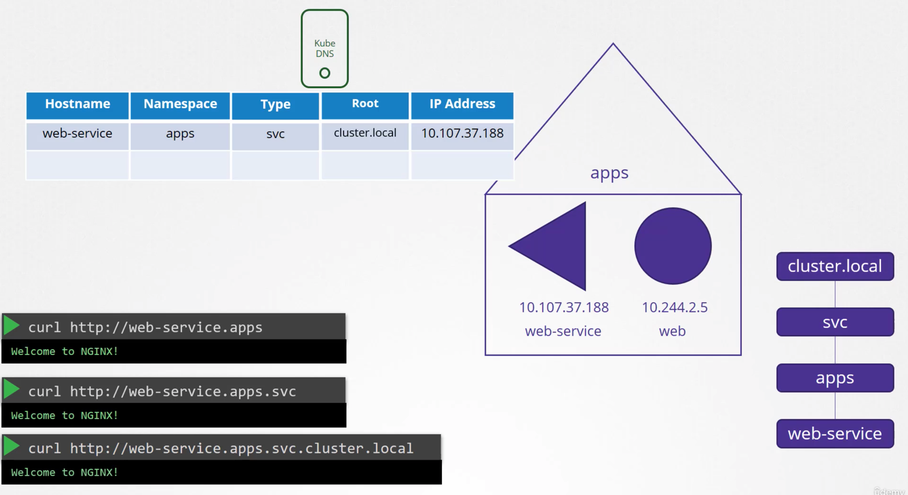
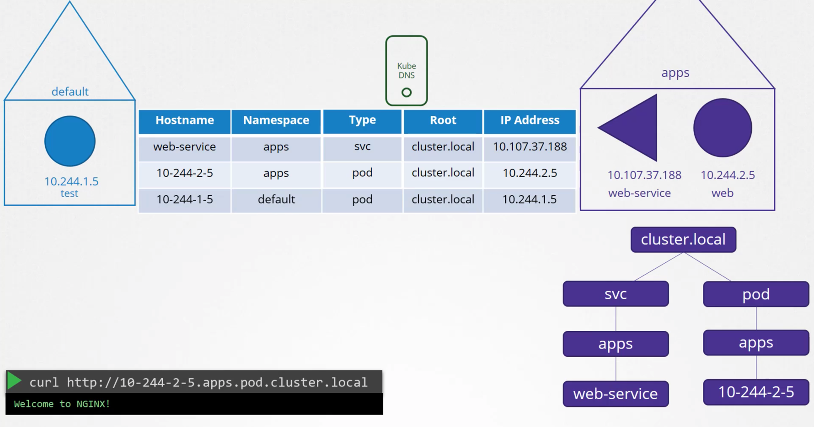
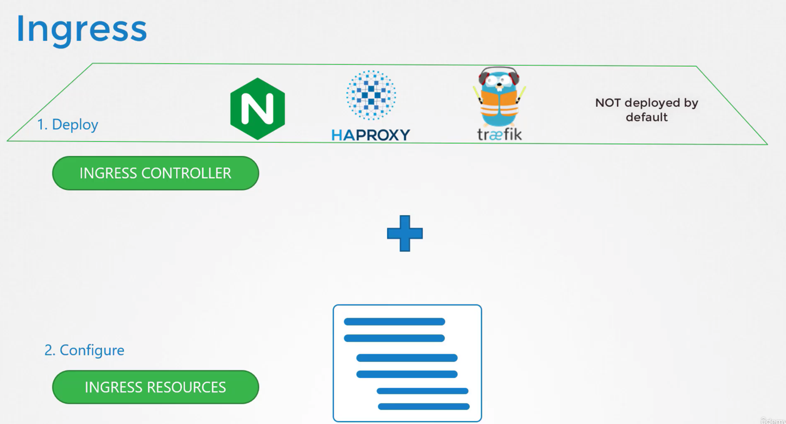
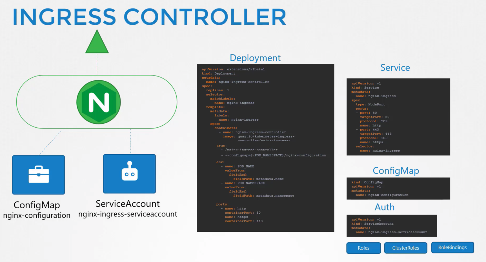
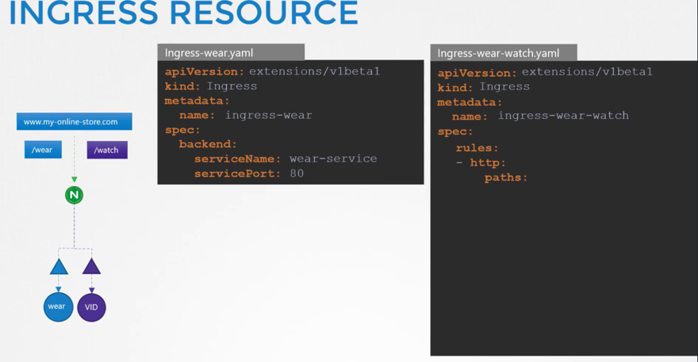
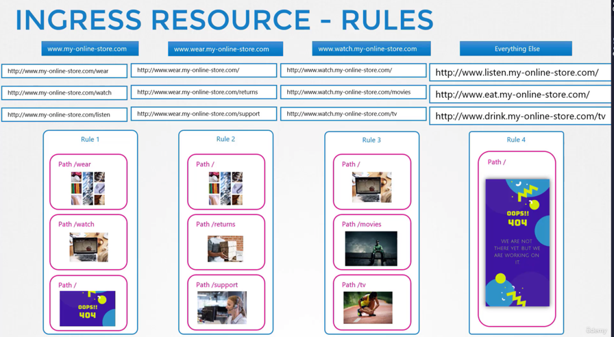
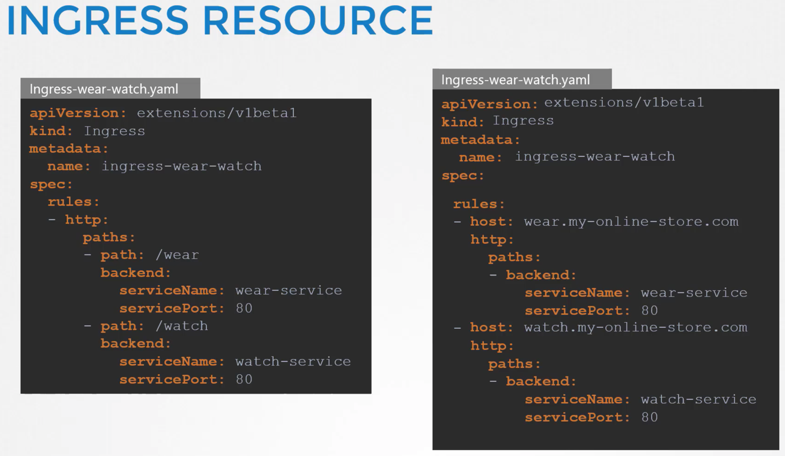
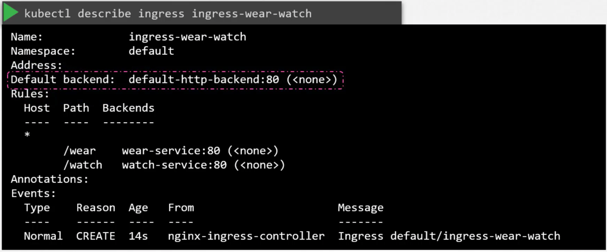

# Networking | Kubernetes

## Overview
1) Cluster Networking 
2) Pod Networking
3) CNI in Kubernetes
4) CNI Weave
5) IP Address Management

## 1 | Cluster Networking

General Facts:
1) Each Node - Must have an Interface connected to a Network
2) Each Interface - Must have an IP Address Configured for it
3) Each Host (Usually only 1) - Must have Unique HOST-NAME + Unique MAC Address

#### K8s Ports General
| Component| Port
| ---- | ----------- |
| API-Server | 6443 |
| ETCD | 2379 |
| ETCD2 (Multi-Master) | 2380 |
| Kubelet (W+M) | 10250 |
| Scheduler | 10251 |
| Controller-Manager | 10252 |

#### Helpful Commands for Practice Test

## 2 | Pod Networking

Regarding Pod communication outside current Node, we shouldn't have to care about:
- What IP it is
- What range/subnet it belongs to
- etc.

### Example Scenario
SETUP: We have a 3-Node Setup on {192.168.1.11,192.168.1.12,192.168.1.13}

### Example | 1. Pod2Pod Communication Per Node
1)  ***Creates Network Namespaces*** - K8s does this on Container Creation
2) ***Create/Setup Bridge Network*** per node: 
- a. Create Bridge per Node: 
> // PER BRIDGE \
> ip link add v-net-0 type bridge \
ip link set dev v-net-0 up

- b. Create IP for each Bridge - Each Node's Bridge should be on its ***own private subnet***
- c. Assign Bridge-IP to Interface

> ip addr add 10.244.1.1/24 dev v-net-0 \
ip addr add 10.244.2.1/24 dev v-net-0 \
ip addr add 10.244.3.1/24 dev v-net-0

3) ***Attach Namespaces to Bridge Network*** - (To DELETE)

4) Now in Each Node, we create a SCRIPT that does the following ***Per-Container!!!***:
- a. Create a Pipe: 
- b. Attach Interfaces - To Container+Bridge: 
- c. Assign IP Addresses to Interfaces: 
- d. Assign Default Routes to Interfaces: 
- e. Bring Up Interface

#### If we have 3 Nodes w/ 2 Containers each, we will run above steps *Six Times!!!*

### Example | 2. Pod2Pod Communication ACROSS Nodes

#### MANUAL WAY
Say the following:
- PodA on Node1 wants to talk to PodC on Node2
- PodA pings PodC
    - Fails bcz it doesn't know about it
    - So the Ping gets Routed to its default route, ***Node1's IP***
    - We need to add a Route to the Node
  
#### Per Node Steps: Given Node1: {PodA,PodB}, Node2: {PodC,PodD}, Node3: {PodE,PodF}
    for node in nodes:
      for other_node in other_nodes:
        for pod in other_node_pods: 
          node ip route add podIP via other-nodeIP

#### AUTOMATIC WAY
Use a router to map each network's IP to a Gateway

#### BREAKDOWN^^ 
Node IPs - { 192.168.1.11, 192.168.1.12. 192.168.1.13 }
Bridge IPs - { 10.244.1.1, 10.244.2.1, 10.244.3.1 }
Bridge Interfaces - { 10.244.1.0/24, 10.244.2.0/24, 10.244.3.0/24 }

### CNI
Tells us how to structure the Script.

#### W/Out CNI

#### With CNI

### Kubelet
**Recall** - Kubelet per Node is responsible for creating/deleting pods & containers

    // These are passed as args to the Kubelet (On Setup)
    --cni-conf-dir=/etc/cni/net.d
    --cni-bin-dir=/etc/cni/bin
    // Executed in the BIN directory like this:
    ./net-script.sh add [CONT] [NS]

## 3 | CNI in Kubernetes

Where do we specify the CNI Plugins for k8s?

isGateway - Defines whether Bridge Network should have an IP assigned to it (so it can act as a gateway)

ipMasq - Defines whether NAT rules should be added for IP masquerading

subnet - Range of IP addresses that will be assigned to Pods && any necessary routes

## 4 | Weave CNI
What's wrong w/ the Routing Table we had? 
=> It may not work for hundreds of nodes in a cluster
==> Routing Table may not support that many entries

#### WeaveWorks General:
  - Deploys Agent to each Node in the Cluster
  - Each Agent knows about each other/can discover each other
  - Each Agent intercepts each call and delivers it to each Agent on the appropriate Node

#### WeaveWorks Specific:
- *Agent/Peer* - Stores a topology of the entire Cluster
- Weave Creates - Bridge called ***Weave*** on each Node
- Assigns IP Address - To Each Node

NOTE:
- Single Pod - Can be attached to multiple bridge networks
  - Ex. Pod can be attached to ***Weave Bridge*** as well as ***Docker Network*** Bridge 

WALKTHROUGH:
1) Packet is sent from PodA - To PodB (on a different node)
2) SENDING - AgentA Intercepts Packet && Encapsulates it with new {SRC,DST}
3) RECEIVING - AgentB Receives Packet && Decapsulates it 

#### Deploying Weave
Weave/Weave-Peers - Can be deployed as:
1) *services*, or ***daemons*** - On each node in the cluster
2) Or if K8s is setup already - As ***Pods*** in the cluster
==> W/ single kubectl apply -f ""
   
Weave-Peers - Deployed as a Daemonset on each Node in the Cluster

## 5 | IP Address Management (IPAM) in CNI

NOTE - This does not concern IP addresses assigned *to the nodes*

What this section covers: 
  - How are virtual bridge networks in the nodes assigned an IP Subnet?
  - How are the Pods Assigned an IP?
  - Where is information stored
  - Who ensures there are no duplicates?

#### How can we assign non-duplicate IPs?
1) Use ***host-local*** IPAM Plugin - For assigning free IPs to Pods
2) Still our responsibility - To ***invoke*** that plugin
  - Manual - We have to invoke it
  - Dynamic - Specify in CNI config => ***/etc/cni/net.d/net-script.conf***

#### Weave - Default IP Address Management
  - Allocates (10.32.0.0/12)
  - Gives (10.32.0.1 > 10.47.255.254) // ~1mil Pod IPs
  - Weave-Peers split IP's equally amongst the nodes

## 6 | Service Networking

Recall - A Service is accessible from all Pods on the Cluster, irrespective of what Node it is on.

ClusterIP Service - Accessible:
  - Intra-Cluster (Unlike Pods)
  - **NOT** Inter-Cluster

NodePort Service - Accessible:
- Intra-Cluster (Unlike Pods)
- Inter-Cluster

Services vs. Pods
1) Pods - Have Containers w/ Namespaces, Interfaces, & IPs
2) Pods - Have NO Namespaces, Interfaces, IP's, etc.
####==> So how do they get IP address?

### Kube-Proxy 
1) Creates Forwarding Rules per Node
2) These Rules - Forward Traffic intended for the SVC to the Pods 

#### Kube-Proxy | Rule-Creation Types
1) User-Space 
2) ipvs
3) iptables (DEFAULT)

#### Where is the ClusterIP svc's subnet defined?
==> *kube-api-server --service-cluster-ip-range ipNet
  - Default - 10.0.0.0.0/24

MAKE SURE THESE IP RANGES DON'T OVERLAP
Service IPs: 10.96.0.0/12 => {10.96.0.0, 10.111.255.255}
POD IPs: 10.244.0.0/16 => {10.244.0.0, 10.244.255.255}

#### Kube-Proxy Commands
1) iptables -L -t nat | grep db-service
2) ps aux | grep kube-api-server 

## 7 | DNS in Kubernetes

Node IPs/Names - Registered in your organization's DNS Server *(Not our concern)*

#### Objectives
1) Intra-Cluster DNS Resolution - Between the Nodes

Kubernetes deploys a built-in DNS server by default

#### Regarding Service Creation
1) k8s DNS Service - Creates a Record for the Service
  ==> Maps the Service-Name ==> To the IP Address

NOTE - All Pods/Services are grouped together in a subdomain using the namespace
  - ***Services are further grouped into "svc" subdomain***

#### Regarding Pod Creation
1) Pod Record Creation - NOT enabled by default
2) Name ISN'T USED - Instead, Pod-IP is used (but w/ "-" instead of ".")
  - Example: (10.244.2.5 => 10-244-2-5)
 
QUESTIONS:
1) What type of records does the DNS Service Create
2) If DNS creates name-IP Service Records, 
   - Who creates the records for Mapping Service-IP's to Pod IPs?
   - And what are those records called?

#### SVC-FQDN

#### POD-FQDN

## 7 | CoreDNS

**Preferred DNS-Server**
1) Pre k8s@1.12 - ***kube-dns***
2) Post k8s@1.12 - ***CoreDNS***

#### CoreDNS Deployment
1) Deployment in kube-system ns - 2 Pods
2) Configuring CoreDNS - /etc/coredns/Corefile
    - Consists of *Plugins* (basically keys in the file)
    - Passed into Pod - As a ConfigMap called **coredns**

#### Where is the Cluster's Top-Level Domain set?
- In */etc/coredns/Corefile* - ***kubernetes*** key

#### How can you enable Pod Records to be created?
- In */etc/coredns/Corefile* - ***pod*** key

#### How can you specify additional nameservers for Records that DNS can't solve?
- In */etc/coredns/Corefile* - ***proxy*** key (/etc/resolv.conf holds the additional nameservers)

#### How do the pods reach the DNS Server (Or CoreDNS Pod)?
- CoreDNS also creates SVC - Called ***kube-dns***
- ***Kubelet*** per Node - Adds kube-dns svc's IP to all Pods' "/etc/resolv.conf"
    - This kube-dns IP is in the Kubelet's "/var/lib/kubelet/config.yaml" file

## 8 | Ingress
Recall - Service NodePort's - Can only allocate ports > 30,000

### Setup Scenario | On-Prem vs. Cloud
We have an application that we want to expose outside of our cluster

### Ingress General
1) Built-In L7 Load-Balancer
2) NOTE - To Expose Ingress outside of your Cluster
    - Still have to Publish as NodePort/LoadBalancer Service 

#### K8s Ingress Implementation | 2 Components

1) **Ingress Controller** - Reverse Proxy
    - Created as - *Deployment*
2) **Ingress Resources** - *Network Traffic **Rules*** 
    
- NOTE - K8s by default ***DOES NOT*** come w/ Ingress Controller

### IC (Ingress Controller) | Nginx Example

#### Ingress Controllers - Nginx, Contour, HAProxy, Traefik, Istio, GCE (Google's L7 HTTP Load-Balancer)
- GCE/Nginx are currently best supported
- Controllers - Have Additional intelligence for watching cluster (for new resources/rules)

**A) IC Main | Deployment**
1) Within Image - Nginx Program is stored at "/nginx-ingress-controller"
2) Configuring Nginx - *Use a **ConfigMap***
3) Also must Specify - 2 Environment Variables
    - PodName
    - PodNamespace
4)  Also must Specify - 2 Ports (HTTP-80 && HTTPS-443)
5) FINALLY - We need a Service to expose the Controller as a Service (NodePort here)

**B) Exposing IC | Service**
1) Map the Deployment's Ports - To External Ports here (Also specify Protocols)

**C) IC ServiceAccount | For Cluster-Watching (New Rules)**
1) Should have correct - Roles/RoleBindings/ClusterRoles

### IR (Ingress Resources) | Online-Store Example

**A) IR Main | Ingress**
1) Traffic will be Routed - To ***Pod-Services***, not Pod-IPs directly

#### Example | 4 Rules
*Each Rule Routes Top-Level Domain - **To a Subdomain***
- Subdomains - *"wear.my-online-store.com", "watch.my-online-store.com"*
- We create *additional Ingresss* - **Per Subdomain**

#### Traffic Splitting | 2 Ways
1) By URL - 1 Rule, 2 Paths
2) By HostName - 2 Rules, 1 Path 

### Examining Ingress Resources

    

