# Networking | Pre-requisites 

## Pre-requisites
1) Switching/Routing
2) DNS
3) CoreDNS
4) Network Namespaces
5) Docker Networking
6) CNI
7) Explore Kubernetes Environment

## Overview
1) Networking Configuration on Cluster Nodes

2) POD Networking Concepts 

3) CNI in Kubernetes

4) Service Networking

5) Cluster DNS

6) Network Loadbalancer

7) Ingress

## 1 | Switching

- How does System-A reach System-B?
    - ***Use a Switch***
    - To Connect them to a **switch**, we need an ***interface***
    
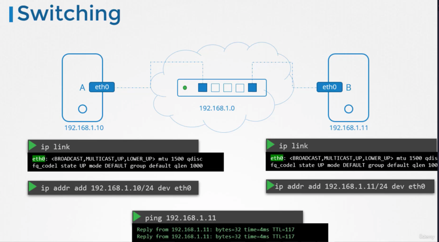

### Router - Connects multiple Networks together
- Network - Multiple, ***switch***-connected computers

In this Scenario: 
- When System-B is sending a packet to System-C
    - How does it know where the Router is on the network?
    - (Since the router is just a device on the network, and there could be many such networks)
    
***Gateway/Route*** - Is like a door to the outside room (other networks/systems, etc.)

### COMMANDS

    ip route add SWITCH-IP via ROUTER-IP
    ip addr add SYSTEM-IP/24 dev INTERFACE // INTERFACE = eth0, for example
    

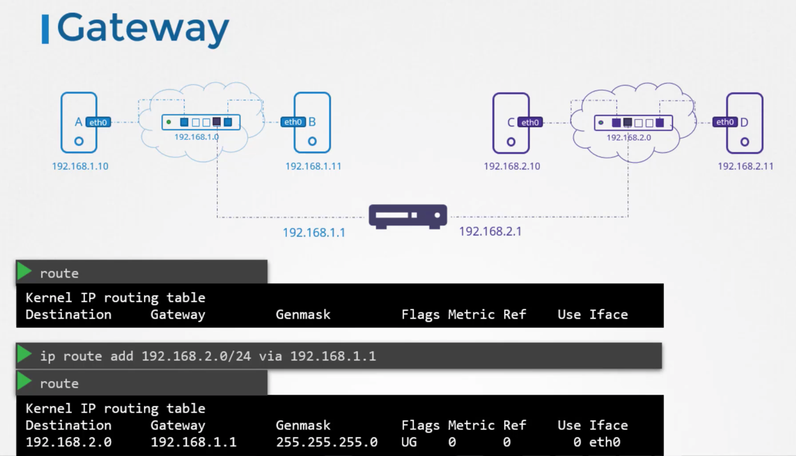

### So many Routes for so many IPs. Can we specify a *default*?

### Default Gateway
- ***default*** - Indicates default
- ***0.0.0.0*** - Also indicates Default
- ***0.0.0.0 in Gateway field*** - Indicates that system ***doesn't need a gateway***

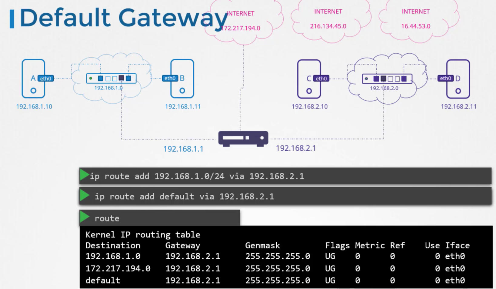

### Multi-Router Setup 
Say 2 Routers, for the following:
1) Internet-Facing Applications
2) Internal Network

### Setting up Linux Host | As a Router  
**Linux Default** - Packets are not forwarded from 1 interface to another

### Takeaways
1) ***ip link*** - List/Modifies Interfaces on the Host
2) ***ip addr*** - List what IP Addresses are assigned to what interfaces
3) ***ip addr add SYSTEM-IP/24 dev INTERFACE*** - Sets IP addresses on the interfaces
4) ***ip route*** - Viewing routing table
5) ***ip route add SWITCH-IP/24 via ROUTER-IP*** - Add Entries to the routing table
6) ***cat /proc/sys/net/ipv4/ip_forward)*** - Check if IP Routing is enabled

HOW TO PERSIST CHANGES - Set in ***/etc/network/interfaces***

---
## 2 | DNS
Recall: We can ping another server via their  **IP-Address**
- ***Now*** - We want to associate a particular IP-Address with a ***Name***

#### How can we associate a particular IP Address w/ a Host?
- ***cat >> /etc/hosts***

#### Different Host Names
- Whatever Server-B's hostname is in Server-A's "/etc/hosts" directory
    - Isn't the same as whatever name is in Server-B's 
    

#### Name Resolution | Translating HostName to IP-Address
- Mapping is in - "/etc/hosts" file
- Single IP Address - Can have multiple names

#### Disadvantage of this
- If a Single Server's IP Changes 
    - ***Would need to modify in all servers' files***
    
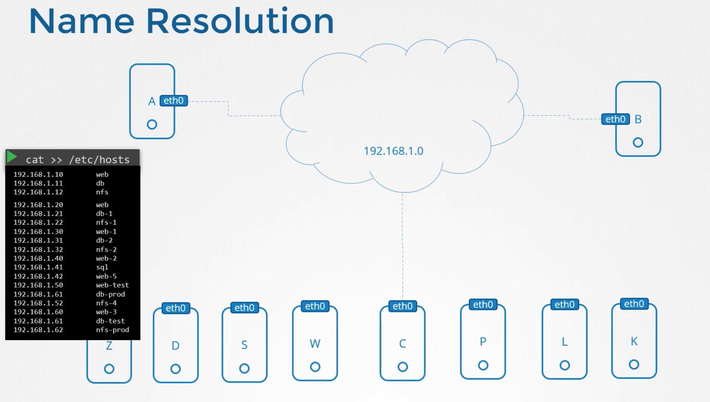

### DNS Overview
- Move all our hosts' IP/Host-Name Mappings to a ***DNS-Server***
- Point all our hosts to - DNS Server
- Whenever a host encounters an unknown Host - Looks up from DNS-Server
- While you *no longer **need*** your "/etc/hosts" file 
    - You can still use it for testing, etc. 

#### "etc/resolv.conf"
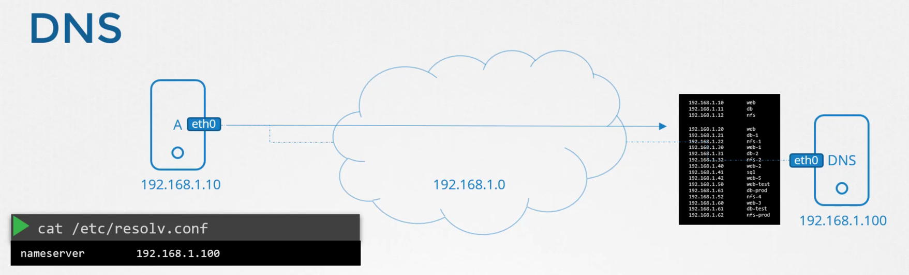

#### What happens if you have same entry in both places? ("/etc/hosts" && DNS Server)
1) Default - First Checks "/etc/hosts"
2) But this order can be changed via the ***/etc/nsswitch.conf***

#### Multiple Nameservers
1) You can add other Nameservers in addition to your local DNS
    - In the event your local DNS cannot resolve a particular site
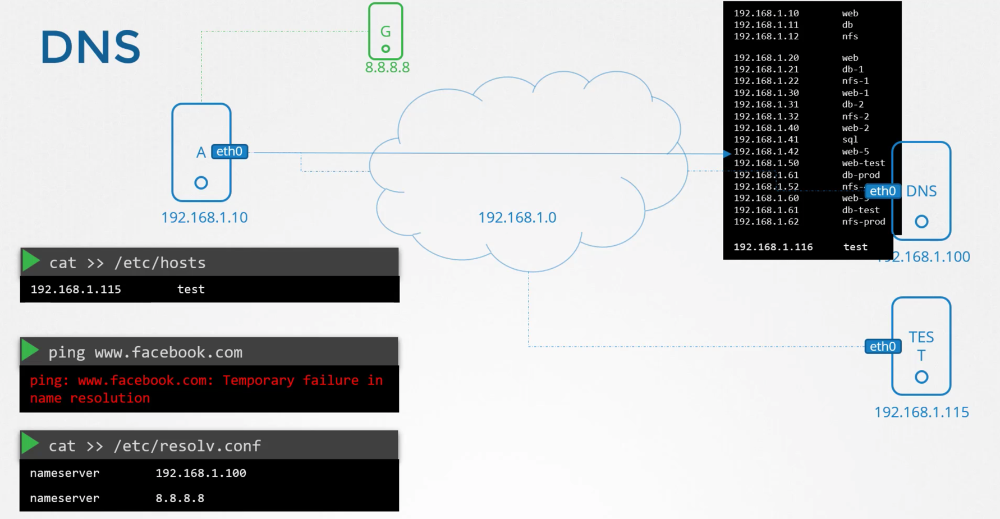

2) You can configure your DNS to forward unknown host requests to another nameserver
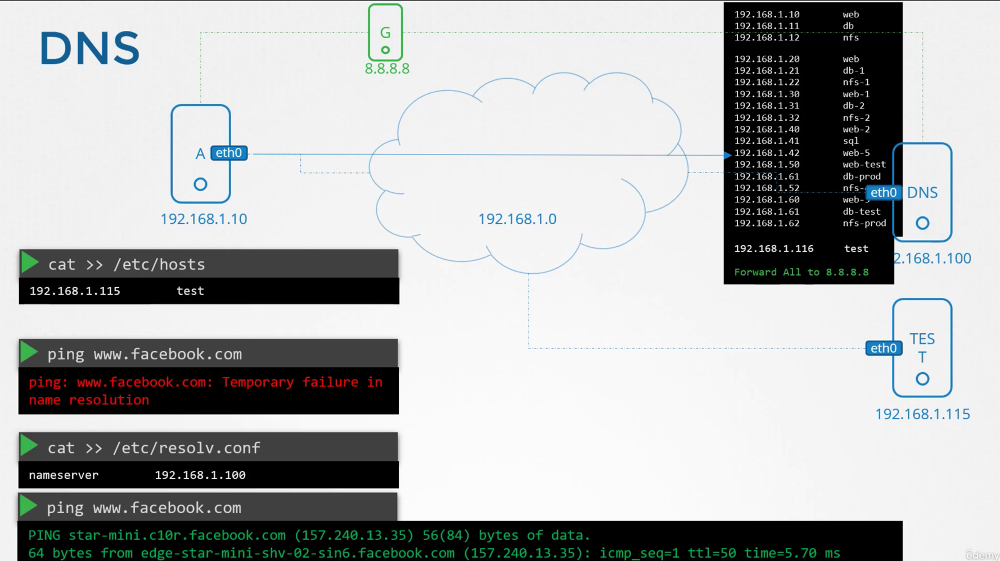

### Domain Name Overview
1) Top-Level Domains (.net,.org,.edu...) 
2) Sub-Domain - Further breaks down domains

| Top-Level Domain | Description
| ----------- | ----------- | 
| .com | 
| .net | Network
| .edu | Educational Organizations
| .org | Non-Profits
| .io  |

### Reaching Domain names | Steps
Say we are trying to reach ***apps.google.com***

| Step | Action | Checks
| ----------- | ----------- | ----------- |
| 1 | Org's Internal DNS | "." 
| 2 | Root DNS | ".com"
| 3 | .com DNS | "Google" 
| 4 | Google DNS | "apps"

#### Above may be cached

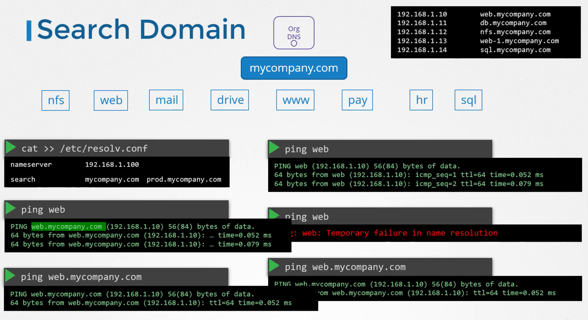

#### Record Types
| Type | Action | Map_A | Map_B
| ----------- | -----------     | -----------       | ----------- |
| A     | IP<=>Host-Names       | web-server        | 192.168.1.1 
| AAAA  | IPV6<=>Host-Names     | web-server        | 2001:0db8:85a3:0000:0000:8a2e:0370:7334
| CNAME | Host-Name<=>Host-Name | food.web-server   | eat.web-server, hungry.web-server

#### Versus Ping
- nslookup - Only consults DNS 
    - ***Does not*** consider local "etc/hosts" file
- dig - Similar to nslookup

---
## 3 | Network Namespaces

#### Background | Process Namespace
- When we create a container, we want to ensure it doesn't see any other ***processes***
- But ***underlying host*** can still view the other processes

### Network Namespace | Intro
Our Host has the following
1) Interface
2) Routing Table
3) ARP Table

We want to isolate our container in it's own ***network namespace***

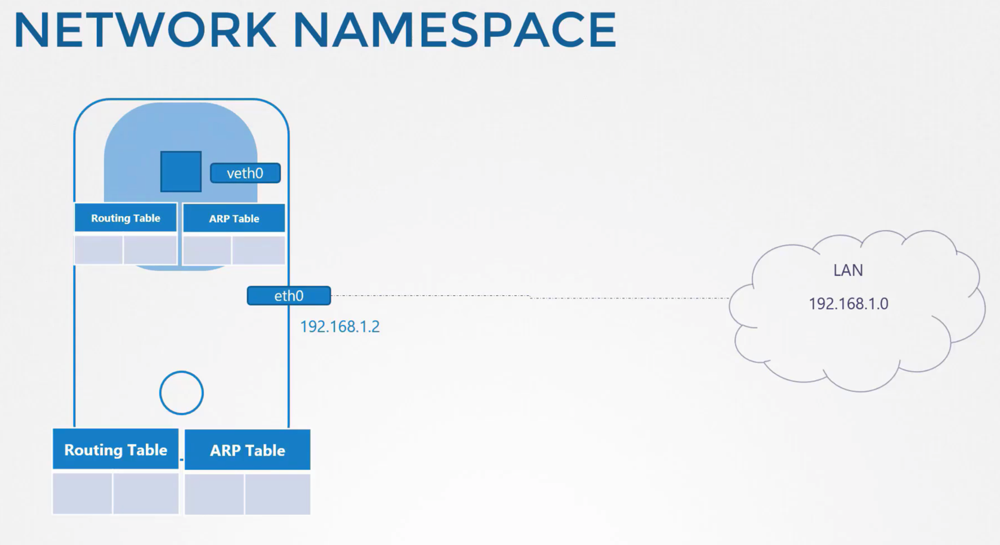

| Command                  | Verb        | Noun |
| -----------              | ----------- | ----------- |
| ***ip netns***           | LIST        | Namespaces       |
| ***ip netns add [NS]***  | ADD         | Namespaces       |
| ***ip link***            | LIST        | Interfaces       |
| ***ip -n [NS] link***    | LIST        | Interfaces ***inside a namespace***       |
| ***arp***                | LIST        | ARP entries      |
| ***ip -n [NS] arp***     | LIST        | ARP entries ***inside a namespace***     |
| ***route***              | LIST        | Routing Table entries      |
| ***ip -n [NS] route***   | LIST        | Routing Table entries ***inside a namespace***     |
| *SECTION 2 - Connecting Namespaces*               
| ***ip link add [ETH-0] type veth peer name [ETH-1]***   | CONNECT        | 2 Interfaces together     |
| ***ip link set [ETH-0] netns [NS-0]***                  | SET            | Interface-on-Namespace     |
| ***ip -n [NS-0] addr add [IP-0] dev [ETH-0]***          | ADD            | IP-to-Namespace     |
| ***ip -n [NS-0] link set [ETH-0] up***                  | SET            | Interface-to-UP     |
| *SECTION 3 - Virtual Switch/Network*
| ***ip link add v-net-0 type bridge***                   | ADD | Virtual-Bridge-Network     |
| *SECTION 4 - External Communication*
| ***iptables -t nat -A POSTROUTING -s [HOME-IP]/24 -j MASQUERADE***                   | ADD | NAT Functionality to our Host    |
| ***iptables -t nat -A PREROUTING --dport 80 --to-destination [IP-1]:80 -j DNAT***                   | ADD | Port Forwarding Rule    |

### Connecting | 2 Network Namespaces
This is often called ***piping***. Steps involve...

| Step | Action | Command |
| ---- | ----------- | ----------- |
| 1    | Connect 2 interfaces (ETH-0, ETH-1) together | ip link add [ETH-0] type veth peer name [ETH-1]
| 2    | Attach Interfaces to their Namespaces        | ip link set [ETH-0] netns [NS-0]
| 3    | Assign IP Address - For Each Namespace       | ip -n [NS-0] addr add [IP-0] dev [ETH-0]
| 4    | Set the interfaces - To ***Up***             | ip -n [NS-0] link set [ETH-0] up

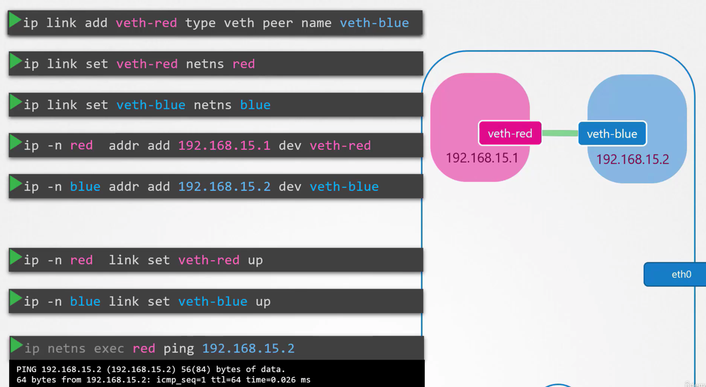

### Linux Bridge | Connecting MANY Network Namespaces
We follow similar steps as we do in the physical world...
- *Requires a **Virtual Switch** (can use Linux Bridge, Open vSwitch, etc.)*

TERMINOLOGY:
1) [BRIDGE] - *v-net-0*
2) 

| Step | Action | Command |
| ---- | ----------- | ----------- |
| 1    | Create Virtual-Network/Switch/Bridge - Within Host        | ip link add [BRIDGE] type bridge
| 2    | Set Ethernet link to Up                                   | ip link set dev [BRIDGE] up
| 3a    | Add Link from [NS-0] to Bridge's [ETH-0]                 | ip link add [ETH-0] type veth peer name [BR-ETH-0]
| 3b    | Set [ETH-0] link to [NS-0]                               | ip link set [ETH-0] netns [NS-0]
| 3c    | Set [BR-ETH-0] link to Bridge                            | ip link set [BR-ETH-0] master [BRIDGE]
| 3d    | Set [IP-0] on [ETH-0]                                    | ip -n [NS-0] addr add [IP-0] dev [ETH-0]
| 3e    | Set [ETH-0] to UP                                        | ip -n [NS-0] link set [ETH-0] up
| 4a    | Add Link from [NS-1] to Bridge's [ETH-1]                 | ip link add [ETH-1] type veth peer name [BR-ETH-1]
| 4b    | Set [ETH-1] link to [NS-1]                               | ip link set [ETH-1] netns [NS-1]
| 4c    | Set [BR-ETH-1] link to Bridge                            | ip link set [BR-ETH-1] master [BRIDGE]
| 4d    | Set [IP-1] on [ETH-1]                                    | ip -n [NS-1] addr add [IP-1] dev [ETH-1]
| 4e    | Set [ETH-1 to UP                                         | ip -n [NS-1] link set [ETH-1] up

NOTE - VS. 2-Namespace Network Solution
- {3b, 3d, 3e} are the same steps as {2,3,4} for 2-Namespace Network Solution

STOPPED AT ~9:19

https://www.udemy.com/course/certified-kubernetes-administrator-with-practice-tests/learn/lecture/14296142#overview
####INTERFACE NOTE (v-net-0 below):
It's like a...
1) ***Interface** - For Host*
1) ***Switch** - For Namespaces*

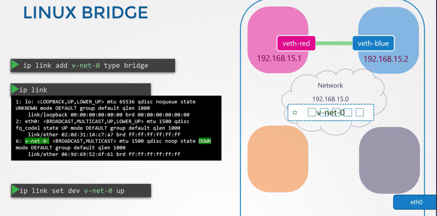

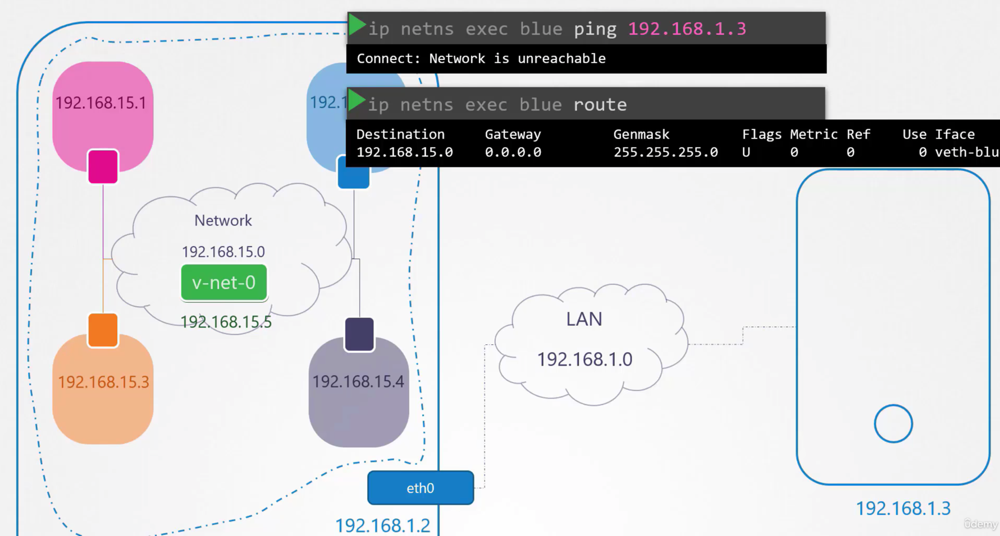
###How do we communicate outside of our namespace?

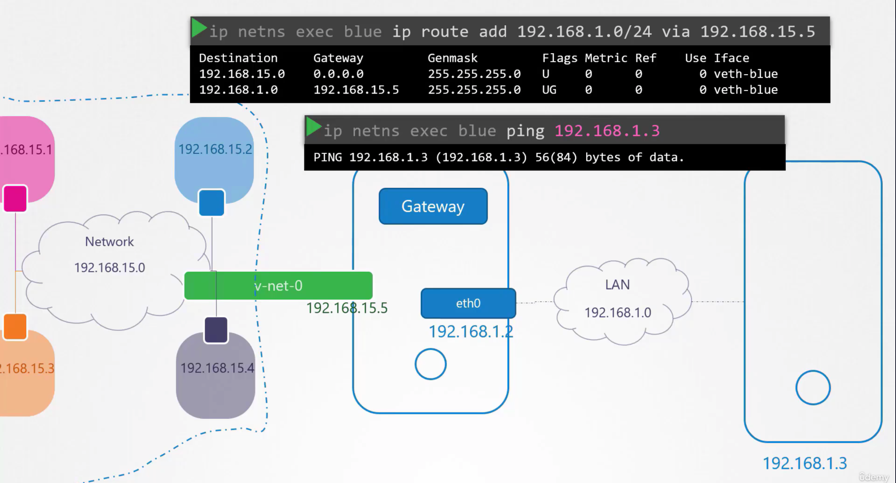

Scenario - We have another host @@ 192.168.1.3
1) Let's try to ping it
    
      
    ip netns exec blue ping 192.168.1.3 
    
2) Let's check the routing table

    ip netns exec blue route
    // Destination Route is not here. We need to add an entry

3) How do we find a route to the external world? \  
    ==> It's our LocalHost!! (The thing in which we created our 2 namespaces in)
   

We can't get a response back
- From home network, we tried to reach the external internet through our router
- But our home network has  internal private IP addresses that the Destination Network didn't know about
- ***So it was unable to ping back***
    
- WE NEED NAT ENABLED ON OUR HOST
--> So it can send messages to the LAN w/ its own name, w/ its own address 

#### Now we want to ping Internet Via LAN
NOTE - Now, since our namespaces can reach any network our host can reach
- So for any external network, we say - Talk to our host!!

#### Outside world to inside??
Two Options: (2nd one is better)
1) Give Private-Network's Identity Away - To Host
    - Add IP-Route Entry to 2nd Host
2) Add Port Forwarding Rule

## 4 | Docker Networking

### Overview | Networking Options
Scenario: Single Docker Host, Single Interface on 192.168.1.10

1) ***NONE*** - Container is not attached to any network

    
    docker run --network none [IMAGE]

2) ***HOST*** - Runs on your host's network (still need to specify container's port)]
    - NOTE - Other containers will not be able to run on the same port 

        

    docker run --network host [IMAGE]
    // Will be available at https://[HOST-IP]:[CONT-PORT]
    // Ex. http://192.168.1.10:80

3) ***BRIDGE*** - Internal Private Network that Docker Host + Containers attach to
    - Network Address - ***172.17.0.0***
    - Other entities will be on networks like - {***172.17.0.2***, ***172.12.0.3***, etc.}
    - BRIDGE-NAME (different for Docker/Host)
        - For Docker - ***Bridge***
        - On Host - ***docker0***

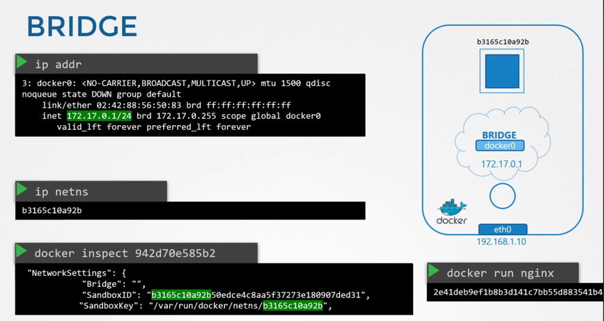

#### Whenever a container is created
- *Docker creates a **namespace** for it*
- Use ***ip netns*** command to list the namespace
- Viewing Container's Network Namespace
    - docker inspect [CONT-ID] // Check NetworkSettings.[SandboxID/SandboxKey]

### GENERAL PROCESS | For Container Creation
1) Namespace is Created
2) Pair of interfaces - Are created
3a) Attach Interface - To Docker Bridge
3b) Attach Interface - To Container

#### INTERFACE IDENTIFICATION 
- Odd/Even - Form 1 Pair
    - Odd -  Bridge
    - Even - Container 

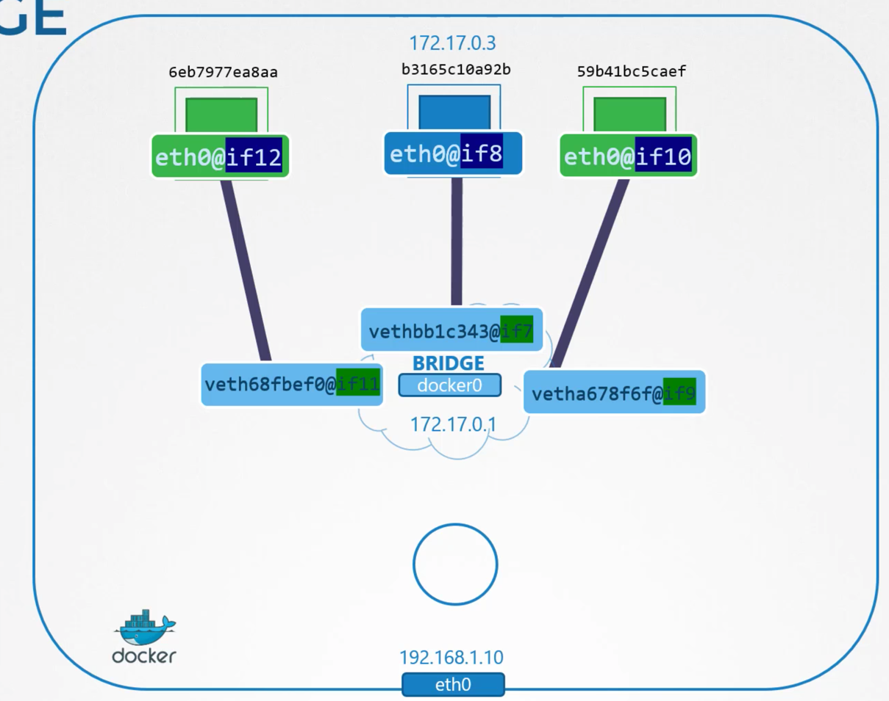

### Port Mapping
*Example*
- Container is running on - 172.17.0.3:80
    - Within Docker Host - *Can Curl Fine*
    - Outside Host - ***Cannot** Curl Fine*

#### Solution
- Forward Traffic from Host-Port (8080) to Container-Port (80)
        
        - docker run -p 8080:80 nginx

Docker uses same NAT (Network Address Translation) we saw earlier for
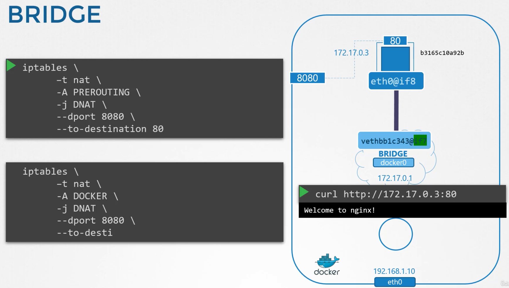

## 5 | CNI (Container Network Interface) 
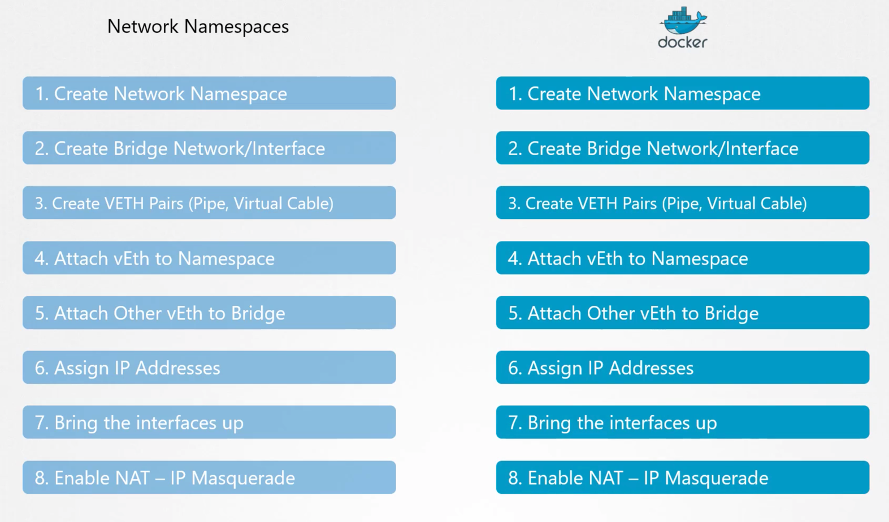

#### These are consolidated into a "bridge" CLI
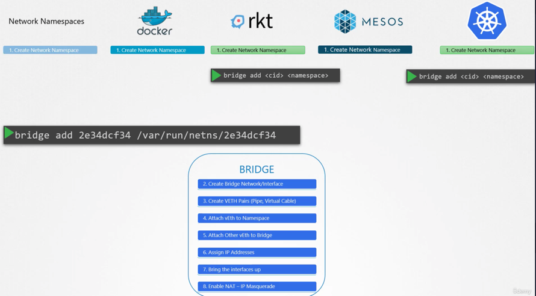
#### But we need a set of standards for all these different solutions to interact w/ "bridge" cli

CNI - Set of standards on how a program (or plugin) should be developed to 
solve networking challenges in a container runtime environment
- Defines: 
    - How the ***Plugin*** - Should be Developed
    - How the ***Container-Runtime*** - Should be Invoked

#### CNI | Primary Responsibilities
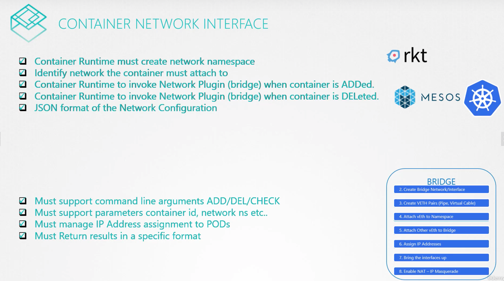

#### CNI | Plugin LIST

| Out-Of-The-Box | 3rd-Party | IPAM (IP Address Management) Plugins |
| ---- | ----------- | ----------- |
| BRIDGE    | Weave             | DHCP
| VLAN      | Flannel           | host-local
| IPVLAN    | Cilium            | 
| MACVLAN   | Calico            | 
| WINDOWS   | VMware NSX        | 
|           | Redhat InfoBlox   | 

***NOTE*** - Docker DOES NOT implement CNI, but CNM (Container Network Model). Bcz of this
- Plugins don't natively integrate w/ Docker
- Basically means you can't do this...

        docker run --network=cni-bridge nginx

- Have to do this instead: 

        docker run --network=none nginx
        bridge add [CONT-ID] /var/run/netns/[CONT-ID] // Manually invoking Bridge yourself
