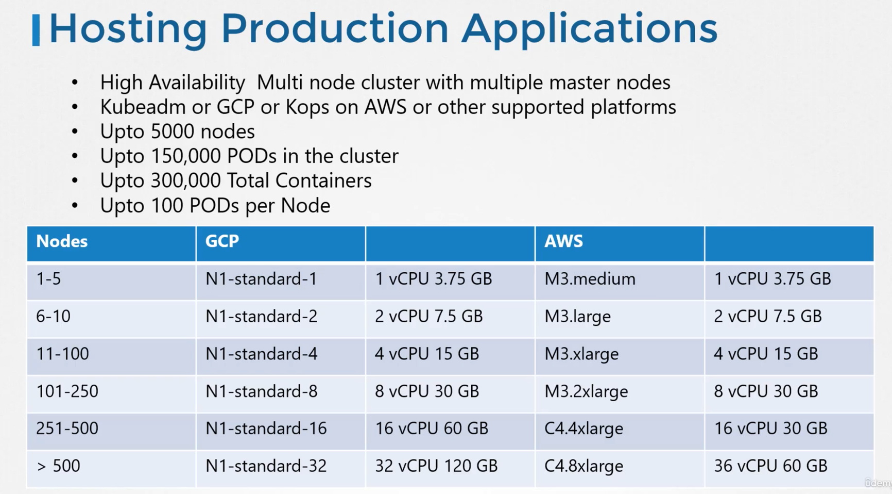
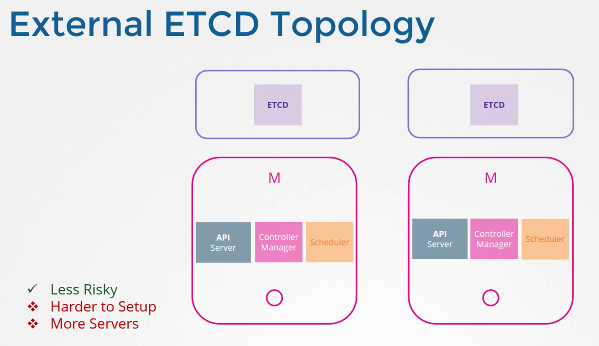

# Design & Install K8s Cluster

## Pre-requisites
1) Switching/Routing
2) DNS
3) CoreDNS
4) Network Namespaces
5) Docker Networking
6) CNI
7) Explore Kubernetes Environment

## 1 | Choosing Kubernetes Infrastructure

### Cloud Solutions

1) Turnkey Solutions - OpenShift, CloudFoundry Container-Runtime, VMWare TKGI, Vagrant
2) Hosted Solutions - GCP GKE, OpenShift Online, AKS, EKS

## 2 | Configure High Availability

### Master Node

#### We have 2 Master Nodes | How is the work split?

Each Master Sub-Component: Can be run...
1) API-Server - Hot:Hot
   - ***Shouldn't send requests to both of them*** 
   - Use Load-Balancer like HAProxy, etc.    
2) Controller-Manager/Scheduler - Hot:Cold
   - Use **--leader-elect** option to select which one
    

- **--leader-elect-retry-period 2s** - How often each of the 2 controller-managers will try to contact API-Server to get the leader lock

#### ETCD | 2 Topology Types

1) Stacked Topology - When Etcd is integrated w/ the ControlPlane Node
   
2) External Topology - Etcd is separate from ControlPlane
    

## 3 | Etcd in HA
Etcd is distributed, reliable, key-value store that is Simple, Secure & Fast

### Etcd Writes | HA Etcd
How do Writes in HA Etcd work?
1) Single-Node (Leader) - Accepts Writes, & Sends to other Instances
    - If follower gets Write - Forwards to Leader

#### Distrubuted Consensus | Leader Election - RAFT
1) 3 Nodes - No Leader
2) RAFT Algorithm - Uses random timer to Send requests to other Nodes
    - 1st One to finish Timer - Sends Request (to be leader) to all other Nodes
3) Leader - Continues to send notifications to other masters telling them its still leader

Quorum - Minimum # of Nodes needed in the Cluster to function properly

This is why 3 Nodes are recommended (In 2 Node Setup, if 1 fails, Quorum still can't be met)

1) W/ Even # of Nodes, possibility of Cluster Failing due to Network Segmentation
    - Say you have 6 Nodes - Partition into 2 3-Node Clusters
      - Quorum to meet is 4 Nodes - 3 Nodes can't do it ==> Failed Cluster
    
2) W/ Odd # of Nodes
    - Say you have 7 Nodes - No matter how you partition, 
        - At least 1 of the 2 split-clusters will have 4 Nodes, which meets Quorum

