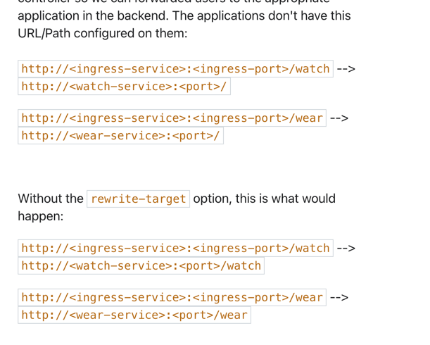

## Questions

#### NOTE | *nginx.ingress.kubernetes.io/rewrite-target: /*

curl https://raw.githubusercontent.com/Kojorising/CKA_Prep/main/alias.sh > alias.sh && source alias.sh && rm alias.sh

kg ingress/ingress-wear-watch -n=app-space -oyaml | grep -Ev "[[:blank:]]f:|[[:space:]]f:|uid:|creationTimeStamp:|generation:|resourceVersion:|manager:|operation:|time:|fieldsType:|fieldsV1:"

alias YML="grep -Ev '[[:blank:]]f:|[[:space:]]f:|uid:|creationTimeStamp:|generation:|resourceVersion:|manager:|managedFields:|operation:|time:|creationTimestamp:|fieldsType:|fieldsV1:|- apiVersion:|[[:blank:]].:'"
kg ingress/ingress-wear-watch -n=app-space -oyaml | YML
### 1) We have deployed Ingress Controller, resources and applications. Explore the setup.

 
  
Answer

    root@controlplane:~# kubectl get all,cm,secret,ing,svc -n=ingress-space
    NAME                                            READY   STATUS    RESTARTS   AGE
    pod/nginx-ingress-controller-697cfbd4d9-7d2dv   1/1     Running   0          3m2s
    
    NAME                      TYPE       CLUSTER-IP      EXTERNAL-IP   PORT(S)                      AGE
    service/ingress-service   NodePort   10.105.68.100   <none>        80:30080/TCP,443:31899/TCP   3m3s
    
    NAME                                       READY   UP-TO-DATE   AVAILABLE   AGE
    deployment.apps/nginx-ingress-controller   1/1     1            1           3m3s
    
    NAME                                                  DESIRED   CURRENT   READY   AGE
    replicaset.apps/nginx-ingress-controller-697cfbd4d9   1         1         1       3m3s
    
    NAME                                        DATA   AGE
    configmap/ingress-controller-leader-nginx   0      119s
    configmap/kube-root-ca.crt                  1      3m3s
    configmap/nginx-configuration               0      3m3s
    
    NAME                                              TYPE                                  DATA   AGE
    secret/default-token-crvkz                        kubernetes.io/service-account-token   3      3m3s
    secret/nginx-ingress-serviceaccount-token-5mvjr   kubernetes.io/service-account-token   3      3m3s

### 2) Which namespace is the Ingress Controller deployed in?

  
Answer

    ==> ingress-space

### 3) What is the name of the Ingress Controller Deployment?

  
Answer

    root@controlplane:~# k config set-context --current --namespace=ingress-space
    root@controlplane:~# k get deploy
    NAME                       READY   UP-TO-DATE   AVAILABLE   AGE
    nginx-ingress-controller   1/1     1            1           6m31s

### 4) Which namespace are the applications deployed in?

  
Answer

    ==> apps-space

    root@controlplane:~# k get all -A | grep -v kube-system | grep -v ingress-space
    NAMESPACE       NAME                                            READY   STATUS    RESTARTS   AGE
    app-space       pod/default-backend-5cf9bfb9d-5thxf             1/1     Running   0          11m
    app-space       pod/webapp-video-84f8655bd8-wx65v               1/1     Running   0          11m
    app-space       pod/webapp-wear-6ff9445955-v4tcb                1/1     Running   0          11m
    
    NAMESPACE       NAME                           TYPE        CLUSTER-IP      EXTERNAL-IP   PORT(S)                      AGE
    app-space       service/default-http-backend   ClusterIP   10.101.83.91    <none>        80/TCP                       11m
    app-space       service/video-service          ClusterIP   10.100.82.217   <none>        8080/TCP                     11m
    app-space       service/wear-service           ClusterIP   10.103.89.147   <none>        8080/TCP                     11m
    default         service/kubernetes             ClusterIP   10.96.0.1       <none>        443/TCP                      19m
    
    NAMESPACE     NAME                             DESIRED   CURRENT   READY   UP-TO-DATE   AVAILABLE   NODE SELECTOR            AGE
    
    NAMESPACE       NAME                                       READY   UP-TO-DATE   AVAILABLE   AGE
    app-space       deployment.apps/default-backend            1/1     1            1           11m
    app-space       deployment.apps/webapp-video               1/1     1            1           11m
    app-space       deployment.apps/webapp-wear                1/1     1            1           11m
    
    NAMESPACE       NAME                                                  DESIRED   CURRENT   READY   AGE
    app-space       replicaset.apps/default-backend-5cf9bfb9d             1         1         1       11m
    app-space       replicaset.apps/webapp-video-84f8655bd8               1         1         1       11m
    app-space       replicaset.apps/webapp-wear-6ff9445955                1         1         1       11m

### 5) How many applications are deployed in the app-space namespace?
Count the number of deployments in this namespace.

  
Answer

    root@controlplane:~# k get deploy -n=app-space | grep -vc NAME
    3

### 6) Which namespace is the Ingress Resource deployed in?

  
Answer

    root@controlplane:~# k get ing -A
    NAMESPACE   NAME                 CLASS    HOSTS   ADDRESS   PORTS   AGE
    app-space   ingress-wear-watch   <none>   *                 80      14m

### 7) What is the name of the Ingress Resource?

  
Answer

    ==> ingress-wear-watch // From Above

### 8) What is the Host configured on the Ingress Resource?
The host entry defines the domain name that users use to reach the application like www.google.com

  
Answer

    root@controlplane:~# k describe ing/ingress-wear-watch -n=app-space       
    Name:             ingress-wear-watch
    Namespace:        app-space
    Address:          
    Default backend:  default-http-backend:80 (<error: endpoints "default-http-backend" not found>)
    Rules:
    Host        Path  Backends
      ----        ----  --------
    *
              /wear    wear-service:8080 (10.244.0.5:8080)
              /watch   video-service:8080 (10.244.0.6:8080)
    Annotations:  nginx.ingress.kubernetes.io/rewrite-target: /
    nginx.ingress.kubernetes.io/ssl-redirect: false
    Events:       <none>

    

### 9) What backend is the /wear path on the Ingress configured with?

  
Answer

    ==> wear-service (from above)

### 10) At what path is the video streaming application made available on the Ingress?

  
Answer

    ==> /watch

### 11) If the requirement does not match any of the configured paths what service are the requests forwarded to?

  
Answer

    ==> default-http-backend

    Events:       <none>
    root@controlplane:~# k describe ing/ingress-wear-watch -n=app-space | grep Default
    Default backend:  default-http-backend:80 (<error: endpoints "default-http-backend" not found>)

### 12) Now view the Ingress Service using the tab at the top of the terminal. Which page do you see?
Click on the tab named Ingress.

  
Answer

    ==> 404 Error

### 13) View the applications by appending /wear and /watch to the URL you opened in the previous step.

  
Answer

==> Definitely works

### 14) You are requested to change the URLs at which the applications are made available.
Make the video application available at /stream.

  
Answer

    
    apiVersion: networking.k8s.io/v1
    kind: Ingress
    metadata:
      annotations:
        nginx.ingress.kubernetes.io/rewrite-target: /
        nginx.ingress.kubernetes.io/ssl-redirect: "false"
      name: ingress-wear-watch
      namespace: app-space
    spec:
      rules:
      - http:
          paths:
          - backend:
              service:
                name: wear-service
                port:
                  number: 8080
            path: /stream
            pathType: Prefix
          - backend:
              service:
                name: video-service
                port:
                  number: 8080
            path: /stream
            pathType: Prefix
    status:
      loadBalancer:
        ingress:
        - {}
      
      root@controlplane:~# vi 14.yaml
      root@controlplane:~# k replace -f 14.yaml
      ingress.networking.k8s.io/ingress-wear-watch replaced
      

### 15) View the Video application using the /stream URL in your browser.
Click on the Ingress tab above your terminal, if its not open already, and append /stream to the URL in the browser.

  
Answer

    ==> Indeed works

### 16) A user is trying to view the /eat URL on the Ingress Service. Which page would he see?
If not open already, click on the Ingress tab above your terminal, and append /eat to the URL in the browser.

  
Answer

    ==> 404 Error (No Path specified)

### 17) Due to increased demand, your business decides to take on a new venture. You acquired a food delivery company. Their applications have been migrated over to your cluster.
Inspect the new deployments in the app-space namespace.

  
Answer

    root@controlplane:~# k get deploy -A
    NAMESPACE       NAME                       READY   UP-TO-DATE   AVAILABLE   AGE
    app-space       default-backend            1/1     1            1           41m
    app-space       webapp-food                1/1     1            1           69s
    app-space       webapp-video               1/1     1            1           41m
    app-space       webapp-wear                1/1     1            1           41m
    ingress-space   nginx-ingress-controller   1/1     1            1           41m
    kube-system     coredns                    2/2     2            2           49m

### 18) You are requested to add a new path to your ingress to make the food delivery application available to your customers.
Make the new application available at /eat.
- Ingress: ingress-wear-watch
- Path: /eat
- Backend Service: food-service
- Backend Service Port: 8080

  
Answer

    root@controlplane:~# k get svc -A
    NAMESPACE       NAME                   TYPE        CLUSTER-IP      EXTERNAL-IP   PORT(S)                      AGE
    app-space       default-http-backend   ClusterIP   10.101.83.91    <none>        80/TCP                       42m
    app-space       food-service           ClusterIP   10.97.189.186   <none>        8080/TCP                     2m7s
    app-space       video-service          ClusterIP   10.100.82.217   <none>        8080/TCP                     42m
    app-space       wear-service           ClusterIP   10.103.89.147   <none>        8080/TCP                     42m
    default         kubernetes             ClusterIP   10.96.0.1       <none>        443/TCP                      50m
    ingress-space   ingress-service        NodePort    10.105.68.100   <none>        80:30080/TCP,443:31899/TCP   42m
    kube-system     kube-dns               ClusterIP   10.96.0.10      <none>        53/UDP,53/TCP,9153/TCP       50m

=====FOOD-SERVICE=====

    apiVersion: v1
    kind: Service
    metadata:
      name: food-service
      namespace: app-space
      resourceVersion: "4463"
      uid: 5498e8c5-08ec-4a4f-8a56-e9b166e54b4e
    spec:
      clusterIP: 10.97.189.186
      clusterIPs:
      - 10.97.189.186
      ports:
      - port: 8080
        protocol: TCP
        targetPort: 8080
      selector:
        app: webapp-food
      sessionAffinity: None
      type: ClusterIP
    status:
      loadBalancer: {}

=====INGRESS-CONTROLLER=====
apiVersion: networking.k8s.io/v1
kind: Ingress
metadata:
  annotations:
    nginx.ingress.kubernetes.io/rewrite-target: /
    nginx.ingress.kubernetes.io/ssl-redirect: "false"
  name: ingress-wear-watch
  namespace: app-space
  resourceVersion: "1298"
  uid: 679c1d52-f309-42c6-b8ce-a99f0fa65ad3
spec:
  rules:
  - http:
      paths:
      - backend:
          service:
            name: wear-service
            port:
              number: 8080
        path: /stream
        pathType: Prefix
      - backend:
          service:
            name: video-service
            port:
              number: 8080
        path: /stream
        pathType: Prefix
      - backend:
          service:
            name: food-service
            port:
              number: 8080
        path: /eat
        pathType: Prefix
status:
  loadBalancer:
    ingress:
    - {}
    

### 19) View the Food delivery application using the /eat URL in your browser.
Click on the Ingress tab above your terminal, if its not open already, and append /eat to the URL in the browser.

  
Answer

### 20) A new payment service has been introduced. Since it is critical, the new application is deployed in its own namespace.
Identify the namespace in which the new application is deployed.

  
Answer

    ==> critical-space

    root@controlplane:~# k get svc,deploy -A
    NAMESPACE        NAME                           TYPE        CLUSTER-IP      EXTERNAL-IP   PORT(S)                      AGE
    app-space        service/default-http-backend   ClusterIP   10.101.83.91    <none>        80/TCP                       48m
    app-space        service/food-service           ClusterIP   10.97.189.186   <none>        8080/TCP                     8m19s
    app-space        service/video-service          ClusterIP   10.100.82.217   <none>        8080/TCP                     48m
    app-space        service/wear-service           ClusterIP   10.103.89.147   <none>        8080/TCP                     48m
    critical-space   service/pay-service            ClusterIP   10.104.69.83    <none>        8282/TCP                     24s
    default          service/kubernetes             ClusterIP   10.96.0.1       <none>        443/TCP                      57m
    ingress-space    service/ingress-service        NodePort    10.105.68.100   <none>        80:30080/TCP,443:31899/TCP   48m
    kube-system      service/kube-dns               ClusterIP   10.96.0.10      <none>        53/UDP,53/TCP,9153/TCP       57m
    
    NAMESPACE        NAME                                       READY   UP-TO-DATE   AVAILABLE   AGE
    app-space        deployment.apps/default-backend            1/1     1            1           48m
    app-space        deployment.apps/webapp-food                1/1     1            1           8m19s
    app-space        deployment.apps/webapp-video               1/1     1            1           48m
    app-space        deployment.apps/webapp-wear                1/1     1            1           48m
    critical-space   deployment.apps/webapp-pay                 1/1     1            1           24s
    ingress-space    deployment.apps/nginx-ingress-controller   1/1     1            1           48m
    kube-system      deployment.apps/coredns                    2/2     2            2           57m

### 21) What is the name of the deployment of the new application?

  
Answer

    ==> webapp-pay // From above

### 22) You are requested to make the new application available at /pay.
Identify and implement the best approach to making this application available on the ingress controller and test to make sure its working. Look into annotations: rewrite-target as well.
- Ingress Created
- Path: /pay
- Configure correct backend service
- Configure correct backend port

  
Answer

    root@controlplane:~# k explain ing.spec.rules.http.paths.backend.service
    KIND:     Ingress
    VERSION:  networking.k8s.io/v1
    
    RESOURCE: service <Object>
    
    DESCRIPTION:
    Service references a Service as a Backend. This is a mutually exclusive
    setting with "Resource".
    
         IngressServiceBackend references a Kubernetes Service as a Backend.
    
    FIELDS:
    name <string> -required-
    Name is the referenced service. The service must exist in the same
    namespace as the Ingress object.
    
    port <Object>
    Port of the referenced service. A port name or port number is required for
    a IngressServiceBackend.

root@controlplane:~# k get svc/pay-service -n=critical-space -oyaml
apiVersion: v1
kind: Service
metadata:
  name: pay-service
  namespace: critical-space
  resourceVersion: "5131"
spec:
  clusterIP: 10.104.69.83
  clusterIPs:
  - 10.104.69.83
  ports:
  - port: 8282
    protocol: TCP
    targetPort: 8080
  selector:
    app: webapp-pay
  sessionAffinity: None
  type: ClusterIP
status:
  loadBalancer: {}
    
apiVersion: networking.k8s.io/v1
kind: Ingress
metadata:
  name: test-ingress
  namespace: critical-space
  annotations:
    nginx.ingress.kubernetes.io/rewrite-target: /
    nginx.ingress.kubernetes.io/ssl-redirect: "false"
spec:
  rules:
  - http:
      paths:
      - path: /pay
        pathType: Prefix
        backend:
          service:
           name: pay-service
           port:
            number: 8282

### 23) View the Payment application using the /pay URL in your browser.
Click on the Ingress tab above your terminal, if its not open already, and append /pay to the URL in the browser.

  
Answer

apiVersion: networking.k8s.io/v1
kind: Ingress
metadata:
    name: pay-ingress
    namespace: critical-space
    annotations:
        nginx.ingress.kubernetes.io/rewrite-target: /
        nginx.ingress.kubernetes.io/ssl-redirect: "false"
spec:
    rules:
    - http: 
        paths: 
        - path: /pay
          pathType: Prefix
          backend: 
            service: 
                name: pay-service
                port: 
                    number: 8282
            
             
                
    

### 24)

  
Answer

### 25)

  
Answer

## TABLE TEMPLATES

### 2-Col | w/ Steps
| STEP  |               |               |       
| ----- | ------------- | ------------- |
| 1     |               |               |               
| 2     |               |               |               
| 3     |               |               |               
| 4     |               |               |               
| 5     |               |               |               
| 6     |               |               |               
| 7     |               |               |               
| 8     |               |               |               
| 9     |               |               |               
| 10    |               |               |               

### 2-Col | w/ Steps
|       |               |               |       
| ----- | ------------- | ------------- |
|       |               |               |               
|       |               |               |               
|       |               |               |               
|       |               |               |               
|       |               |               |               
|       |               |               |               
|       |               |               |               
|       |               |               |               
|       |               |               |               
|       |               |               |  

## SUMMARY
1) #8 - Ingress Host // Describe

======INGRESS-SPEC======
DESCRIPTION:
     Spec is the desired state of the Ingress. More info:
     https://git.k8s.io/community/contributors/devel/sig-architecture/api-conventions.md#spec-and-status

     IngressSpec describes the Ingress the user wishes to exist.

FIELDS:
   defaultBackend       <Object>
     DefaultBackend is the backend that should handle requests that don't match
     any rule. If Rules are not specified, DefaultBackend must be specified. If
     DefaultBackend is not set, the handling of requests that do not match any
     of the rules will be up to the Ingress controller.

   ingressClassName     <string>
     IngressClassName is the name of the IngressClass cluster resource. The
     associated IngressClass defines which controller will implement the
     resource. This replaces the deprecated `kubernetes.io/ingress.class`
     annotation. For backwards compatibility, when that annotation is set, it
     must be given precedence over this field. The controller may emit a warning
     if the field and annotation have different values. Implementations of this
     API should ignore Ingresses without a class specified. An IngressClass
     resource may be marked as default, which can be used to set a default value
     for this field. For more information, refer to the IngressClass
     documentation.

   rules        <[]Object>
     A list of host rules used to configure the Ingress. If unspecified, or no
     rule matches, all traffic is sent to the default backend.

   tls  <[]Object>
     TLS configuration. Currently the Ingress only supports a single TLS port,
     443. If multiple members of this list specify different hosts, they will be
     multiplexed on the same port according to the hostname specified through
     the SNI TLS extension, if the ingress controller fulfilling the ingress
     supports SNI.

======INGRESS-SPEC======

RESOURCE: rules <[]Object>

DESCRIPTION:
     A list of host rules used to configure the Ingress. If unspecified, or no
     rule matches, all traffic is sent to the default backend.

     IngressRule represents the rules mapping the paths under a specified host
     to the related backend services. Incoming requests are first evaluated for
     a host match, then routed to the backend associated with the matching
     IngressRuleValue.

FIELDS:
   host <string>
     Host is the fully qualified domain name of a network host, as defined by
     RFC 3986. Note the following deviations from the "host" part of the URI as
     defined in RFC 3986: 1. IPs are not allowed. Currently an IngressRuleValue
     can only apply to the IP in the Spec of the parent Ingress.
     2. The `:` delimiter is not respected because ports are not allowed.
     Currently the port of an Ingress is implicitly :80 for http and :443 for
     https. Both these may change in the future. Incoming requests are matched
     against the host before the IngressRuleValue. If the host is unspecified,
     the Ingress routes all traffic based on the specified IngressRuleValue.

     Host can be "precise" which is a domain name without the terminating dot of
     a network host (e.g. "foo.bar.com") or "wildcard", which is a domain name
     prefixed with a single wildcard label (e.g. "*.foo.com"). The wildcard
     character '*' must appear by itself as the first DNS label and matches only
     a single label. You cannot have a wildcard label by itself (e.g. Host ==
     "*"). Requests will be matched against the Host field in the following way:
     1. If Host is precise, the request matches this rule if the http host
     header is equal to Host. 2. If Host is a wildcard, then the request matches
     this rule if the http host header is to equal to the suffix (removing the
     first label) of the wildcard rule.

   http <Object>

======INGRESS-SPEC======

apiVersion: networking.k8s.io/v1
kind: Ingress
metadata:
  annotations:
    nginx.ingress.kubernetes.io/rewrite-target: /
    nginx.ingress.kubernetes.io/ssl-redirect: "false"
  name: ingress-wear-watch
  namespace: app-space
spec: 
  rules:
  - http: 
      paths:
       - path: /watch
         pathType: Prefix
         backend:
            service:  
               name: video-service
               port:
                  number: 8080
       - path: /wear
         pathType: Prefix
         backend:
            service:  
               name: wear-service
               port:
                  number: 8080
       - path: /eat
         pathType: Prefix
         backend:
            service:  
               name: food-service
               port:
                  number: 8080
       - path: /pay
         pathType: Prefix
         backend:
            service:  
               name: pay-service
               port:
                  number: 8080

apiVersion: v1
kind: Service
metadata:
  creationTimestamp: null
  labels:
    app: pay-service
  name: pay-service
  namespace: app-space
spec:
  externalName: pay-service.critical-space.svc.cluster.local
  ports:
  - name: 8080-8282
    port: 8080
    protocol: TCP
    targetPort: 8282
  selector:
    app: pay-service
  type: ExternalName
status:
  loadBalancer: {}

apiVersion: networking.k8s.io/v1
kind: Ingress
metadata:
  annotations:
    nginx.ingress.kubernetes.io/rewrite-target: /
    nginx.ingress.kubernetes.io/ssl-redirect: "false"
  name: ingress-wear-watch
  namespace: app-space
spec:
  rules:
  - http:
      paths:
      - backend:
          service:
            name: wear-service
            port:
              number: 8080
        path: /wear
        pathType: Prefix
      - backend:
          service:
            name: video-service
            port:
              number: 8080
        path: /watch
        pathType: Prefix
      - backend:
          service:
            name: video-service
            port:
              number: 8080
        path: /stream
        pathType: Prefix
      - backend:
          service:
            name: food-service
            port:
              number: 8080
        path: /eat
        pathType: Prefix
      - backend:
          service:
            name: pay-service
            port:
              number: 8080
        path: /pay
        pathType: Prefix
status:
  loadBalancer:
    ingress:
    - {}

curl -H "HOST: foo.bar.com" localhost:8080

apiVersion: v1
kind: Service
metadata:
  name: pay-service
  namespace: critical-space
spec:
  clusterIP: 10.109.214.27
  clusterIPs:
  - 10.109.214.27
  ports:
  - port: 8282
    protocol: TCP
    targetPort: 8080
  selector:
    app: webapp-pay
  sessionAffinity: None
  type: ClusterIP
status:
  loadBalancer: {}

