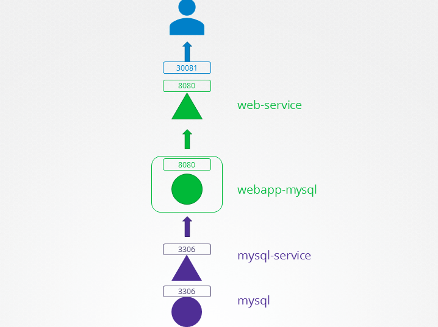

## Questions

curl https://raw.githubusercontent.com/Kojorising/CKA_Prep/main/alias.sh > alias.sh && source alias.sh

### 1) Troubleshooting Test 1: A simple 2 tier application is deployed in the alpha namespace. It must display a green web page on success. Click on the app tab at the top of your terminal to view your application. It is currently failed. Troubleshoot and fix the issue.
Stick to the given architecture. Use the same names and port numbers as given in the below architecture diagram. Feel free to edit, delete or recreate objects as necessary.

 
  
Answer

    ==> WRONG SERVICE-NAME

    NOTE: Just had to change svc's name (from "mysql" to "mysql-service")
       
    apiVersion: v1
    kind: Service
    metadata:
        name: mysql-service
        namespace: alpha
    spec:
      clusterIP: 10.96.78.122
      clusterIPs:
      - 10.96.78.122
      ports:
      - port: 3306
        protocol: TCP
        targetPort: 3306
      selector:
        name: mysql
      sessionAffinity: None
      type: ClusterIP
    status:
      loadBalancer: {}

kubens() { if [ -n "$1" ]; then k config set-context --current --namespace=$1 && kubens; else k config view --minify | grep namespace | sed "s/namespace://" | xargs; fi; }

kubens() { echo $1 | grep -e "^[[:blank:]]*$" || k config set-context --current --namespace=$1; k config view --minify | grep namespace | sed "s/namespace://" | xargs; }
    

### 2) Troubleshooting Test 2: The same 2 tier application is deployed in the beta namespace. It must display a green web page on success. Click on the app tab at the top of your terminal to view your application. It is currently failed. Troubleshoot and fix the issue.
Stick to the given architecture. Use the same names and port numbers as given in the below architecture diagram. Feel free to edit, delete or recreate objects as necessary.

  
Answer

    ==> WRONG TARGET-PORT

    root@controlplane:~# kg svc -owide
    NAME            TYPE        CLUSTER-IP     EXTERNAL-IP   PORT(S)          AGE     SELECTOR
    mysql-service   ClusterIP   10.97.113.27   <none>        3306/TCP         9m27s   name=mysql
    web-service     NodePort    10.97.70.146   <none>        8080:30081/TCP   9m26s   name=webapp-mysql
    root@controlplane:~# kg pods --show-labels
    NAME                            READY   STATUS    RESTARTS   AGE     LABELS
    mysql                           1/1     Running   0          9m38s   name=mysql
    webapp-mysql-75dfdf859f-bbz6s   1/1     Running   0          9m37s   name=webapp-mysql,pod-template-hash=75dfdf859f

    DAMN. Port here is correct...
    root@controlplane:~# kg svc -owide
    NAME            TYPE        CLUSTER-IP     EXTERNAL-IP   PORT(S)          AGE   SELECTOR
    mysql-service   ClusterIP   10.97.113.27   <none>        3306/TCP         22m   name=mysql
    web-service     NodePort    10.97.70.146   <none>        8080:30081/TCP   22m   name=webapp-mysql

    ... But Target-Port is actually wrong (Should be 3306)
    root@controlplane:~# kd svc/mysql-service
    Name:              mysql-service
    Namespace:         beta
    Labels:            <none>
    Annotations:       <none>
    Selector:          name=mysql
    Type:              ClusterIP
    IP Families:       <none>
    IP:                10.97.113.27
    IPs:               10.97.113.27
    Port:              <unset>  3306/TCP
    TargetPort:        8080/TCP
    Endpoints:         10.244.0.8:8080
    Session Affinity:  None
    Events:            <none>

    
    

### 3) Troubleshooting Test 3: The same 2 tier application is deployed in the gamma namespace. It must display a green web page on success. Click on the app tab at the top of your terminal to view your application. It is currently failed. Troubleshoot and fix the issue.
Stick to the given architecture. Use the same names and port numbers as given in the below architecture diagram. Feel free to edit, delete or recreate objects as necessary.

  
Answer

    ==> WRONG SELECTOR

    root@controlplane:~# kg ep
    NAME            ENDPOINTS          AGE
    mysql-service   <none>             3m46s
    web-service     10.244.0.11:8080   3m46s

    root@controlplane:~# kg svc -owide
    NAME            TYPE        CLUSTER-IP       EXTERNAL-IP   PORT(S)          AGE     SELECTOR
    mysql-service   ClusterIP   10.102.124.132   <none>        3306/TCP         4m10s   name=sql00001
    web-service     NodePort    10.97.194.234    <none>        8080:30081/TCP   4m10s   name=webapp-mysql

    root@controlplane:~# kg pods --show-labels
    NAME                            READY   STATUS    RESTARTS   AGE     LABELS
    mysql                           1/1     Running   0          4m17s   name=mysql
    temp                            1/1     Running   0          2m33s   run=temp
    webapp-mysql-75dfdf859f-hsbz8   1/1     Running   0          4m17s   name=webapp-mysql,pod-template-hash=75dfdf859f

    root@controlplane:~# k set selector svc/mysql-service name=mysql
    service/mysql-service selector updated
    root@controlplane:~# kg svc/mysql-service -owide
    NAME            TYPE        CLUSTER-IP       EXTERNAL-IP   PORT(S)    AGE    SELECTOR
    mysql-service   ClusterIP   10.102.124.132   <none>        3306/TCP   5m1s   name=mysql

    root@controlplane:~# kg ep/mysql-service 
    NAME            ENDPOINTS          AGE
    mysql-service   10.244.0.10:3306   5m12s

### 4) Troubleshooting Test 4: The same 2 tier application is deployed in the delta namespace. It must display a green web page on success. Click on the app tab at the top of your terminal to view your application. It is currently failed. Troubleshoot and fix the issue.
Stick to the given architecture. Use the same names and port numbers as given in the below architecture diagram. Feel free to edit, delete or recreate objects as necessary.

  
Answer

    ==> WRONG-ENV VARIABLE

    WRONG DB_User
    - Was: root
    - Now is: sql-user

    ON APP-PAGE:
    Environment Variables: DB_Host=mysql-service; DB_Database=Not Set; DB_User=sql-user; DB_Password=paswrd; 1045 (28000): Access denied for user 'sql-user'@'10.244.0.15' (using password: YES)
    From webapp-mysql-67cfc57cbc-wljkm!
    
    root@controlplane:~# kg pods -owide | grep 10.244.0.15
    webapp-mysql-67cfc57cbc-wljkm   1/1     Running   0          3m14s   10.244.0.15   controlplane   <none>           <none>

    root@controlplane:~# k set env deploy/webapp-mysql --overwrite DB_User=root
    deployment.apps/webapp-mysql env updated
    
    

### 5) Troubleshooting Test 5: The same 2 tier application is deployed in the epsilon namespace. It must display a green web page on success. Click on the app tab at the top of your terminal to view your application. It is currently failed. Troubleshoot and fix the issue.
Stick to the given architecture. Use the same names and port numbers as given in the below architecture diagram. Feel free to edit, delete or recreate objects as necessary.

  
Answer

    root@controlplane:~# kd pod/mysql | grep MYSQL_ROOT_PASSWORD:
      MYSQL_ROOT_PASSWORD:  passwooooorrddd

### 6)

  
Answer

