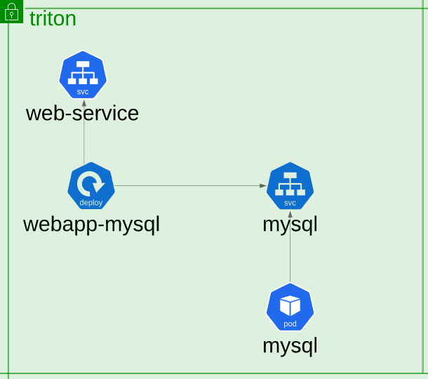

# Questions

curl https://raw.githubusercontent.com/Kojorising/CKA_Prep/main/alias.sh > alias.sh && source alias.sh && rm alias.sh

### 1) **Troubleshooting Test 1:** A simple 2 tier application is deployed in the triton namespace. It must display a green web page on success. Click on the app tab at the top of your terminal to view your application. It is currently failed. Troubleshoot and fix the issue.
Stick to the given architecture. Use the same names and port numbers as given in the below architecture diagram. Feel free to edit, delete or recreate objects as necessary.

 
  
Answer

    
      Normal   Scheduled               5m25s                default-scheduler  Successfully assigned triton/mysql to controlplane
      Warning  FailedCreatePodSandBox  5m23s                kubelet            Failed to create pod sandbox: rpc error: code = Unknown desc = [failed to set up sandbox container "052cd2b6eda7dd62693826bc02db585830bbc375a9a96dad44fa706ffe6c1832" network for pod "mysql": networkPlugin cni failed to set up pod "mysql_triton" network: unable to allocate IP address: Post "http://127.0.0.1:6784/ip/052cd2b6eda7dd62693826bc02db585830bbc375a9a96dad44fa706ffe6c1832": dial tcp 127.0.0.1:6784: connect: connection refused, failed to clean up sandbox container "052cd2b6eda7dd62693826bc02db585830bbc375a9a96dad44fa706ffe6c1832" network for pod "mysql": networkPlugin cni failed to teardown pod "mysql_triton" network: Delete "http://127.0.0.1:6784/ip/052cd2b6eda7dd62693826bc02db585830bbc375a9a96dad44fa706ffe6c1832": dial tcp 127.0.0.1:6784: connect: connection refused]
      Normal   SandboxChanged          0s (x25 over 5m22s)  kubelet            Pod sandbox changed, it will be killed and re-created.

    Noticed there was no Weave Deployment.
    root@controlplane:/# kubectl apply -f "https://cloud.weave.works/k8s/net?k8s-version=$(kubectl version | base64 | tr -d '\n')"
    serviceaccount/weave-net created
    clusterrole.rbac.authorization.k8s.io/weave-net created
    clusterrolebinding.rbac.authorization.k8s.io/weave-net created
    role.rbac.authorization.k8s.io/weave-net created
    rolebinding.rbac.authorization.k8s.io/weave-net created
    daemonset.apps/weave-net created

    root@controlplane:/# systemctl status kubelet | grep -i "fail\|unable\|delete"
    Sep 16 21:26:32 controlplane kubelet[3153]: W0916 21:26:32.189644    3153 cni.go:333] CNI failed to retrieve network namespace path: cannot find network namespace for the terminated container "91afc30e7c7784ccbaed382bd1da6a434e5ecf28812b1b95f7d4e42df6ff7be4"
    Sep 16 21:26:32 controlplane kubelet[3153]: weave-cni: Delete: no addresses for 91afc30e7c7784ccbaed382bd1da6a434e5ecf28812b1b95f7d4e42df6ff7be4

    root@controlplane:/# kg pods
    NAME                            READY   STATUS    RESTARTS   AGE
    mysql                           1/1     Running   0          18m
    webapp-mysql-54db464f4f-xs4pk   1/1     Running   0          18m

root@control

### 2) **Troubleshooting Test 2:** The same 2 tier application is having issues again. It must display a green web page on success. Click on the app tab at the top of your terminal to view your application. It is currently failed. Troubleshoot and fix the issue.
Stick to the given architecture. Use the same names and port numbers as given in the below architecture diagram. Feel free to edit, delete or recreate objects as necessary.

  
Answer

    root@controlplane:/# kgCpF
    kube-proxy-z76pq                       0/1     CrashLoopBackOff   5          4m59s

    root@controlplane:/# kl kube-proxy-z76pq $N
    F0916 21:39:11.582328       1 server.go:490] failed complete: open /var/lib/kube-proxy/configuration.conf: no such file or directory
    
    root@controlplane:/# kd pod/kube-proxy-z76pq $N | grep /var/lib/
    --config=/var/lib/kube-proxy/configuration.conf
    /var/lib/kube-proxy from kube-proxy (rw)
    
    IDIOT!! At top
    root@controlplane:/# kd cm/kube-proxy $N 
    Data
    ====
    config.conf:
    ----
    apiVersion: kubeproxy.config.k8s.io/v1alpha1
    ...
    kubeconfig.conf:
    ----
    apiVersion: v1

    root@controlplane:/# kg ds/kube-proxy $N -oyaml | sed "s/configuration.conf/config.conf/" | k replace -f - 
    daemonset.apps/kube-proxy replaced

    root@controlplane:/# checkCP
    7/7
    

